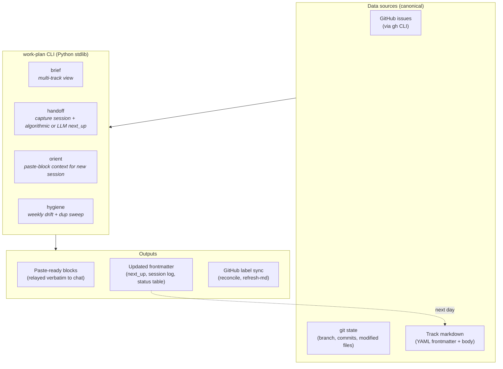

# work-plan toolkit


Track-aware daily work planning for developers running parallel Claude Code / Codex sessions across many GitHub issues.

## What this is

A daily work-planning system for developers running parallel AI sessions across many GitHub issues. It's made of three things: a pure-Python stdlib CLI, a set of YAML-frontmattered markdown files ("tracks"), and a `SKILL.md` that tells your AI how to use the CLI. Together they give you and your agent a shared, live picture of what's in flight — without asking you to maintain it manually.

**Installs as a plugin** for Claude Code and Codex (see [Quick install](#quick-install) for the exact commands), as an npm global for any editor or terminal (`npm install -g @stylusnexus/work-plan`), and as a VS Code extension (search "Work Plan", publisher `stylusnexus`).

The system derives state *live* from GitHub (`gh`), `git`, and your track files on every run — nothing is mirrored or cached. AI sessions get a paste-ready context block; you stay oriented even when switching between a dozen parallel workstreams.

**Why it exists:** born from the frustration of building detailed plans that die the moment you open a new agent session and start over. Inspired by [Andrej Karpathy's notes on vibe coding](https://gist.github.com/karpathy/442a6bf555914893e9891c11519de94f) and the specific pain of doing enthusiastic work on the wrong thing.

## What this is not

- **Not a Jira / Linear / GitHub Projects replacement.** It doesn't manage sprints, roadmaps, or capacity planning — it helps *you and your AI agent* stay oriented on GitHub issues you already have.
- **Not a standalone issue tracker.** GitHub is canonical; `work-plan` just reads and references it.
- **Not zero-setup.** Requires Python 3.9+, the `gh` GitHub CLI (authenticated), and `yq` (the Go version, not the Python one).
- **Not a background service.** No daemon, no cache, no sync loop — `git pull` is the sync mechanism for shared tracks.
- **Not a replacement for reading your code.** It tells you *what* to work on and *where you left off* — not what the code does.

## Quick install

**Claude Code (recommended):**
```
/plugin marketplace add stylusnexus/agent-plugins
/plugin install work-plan@stylus-nexus
```
**Codex:** `codex plugin marketplace add stylusnexus/agent-plugins` → `codex plugin add work-plan@stylus-nexus`
**npm (any editor / standalone CLI):**
```
npm install -g @stylusnexus/work-plan
```
**VS Code extension** (the visual viewer): search **"Work Plan"** (publisher `stylusnexus`) in the Extensions view, or `code --install-extension stylusnexus.work-plan-viewer`. It drives the CLI above — see [VS Code extension](#vs-code-extension).
**Cursor / Copilot / direct:** clone + `./install.sh` (see [Install](#install)).

Full multi-agent guide: the [**agent-plugins** marketplace README](https://github.com/stylusnexus/agent-plugins). See [Install](#install) below for details, the npm path, and updating.

> **Command names:** examples below use the standalone form `/work-plan <subcommand>` (what `install.sh` gives you). **Installed as a plugin, commands are namespaced** — `/work-plan brief` → `/work-plan:brief`, `/work-plan handoff` → `/work-plan:handoff`, and the long tail is `/work-plan:run <subcommand>`. On Codex, invoke via `@work-plan` / `/skills`.

The five essentials you'll use 80% of the time are:

| Command | When |
|---|---|
| `/work-plan brief` | Morning. Multi-track snapshot — what's on your plate across every active track. Run from inside a configured repo's checkout and it **auto-scopes to that repo** (one-line banner; `--repo=all` shows everything). Add `--repo=<key>` to scope to a specific project. |
| `/work-plan handoff <track>` | End of a work block. Captures what you touched. Use `--auto-next` for an algorithmic priority-sorted `next_up` (no LLM), `--set-next 1,2,3` for explicit numbers, or pair with Claude in chat for a curated pick. |
| `/work-plan orient <track>` | Switching context. ~15-line paste-block of priority / last session / next pick / git state — drop into a fresh Claude Code terminal. |
| `/work-plan reconcile <track> \| --all \| --repo=<key> [--draft] [--yes]` | Track frontmatter membership drifted from GitHub labels. Use on label-driven tracks only — for hand-curated tracks, use `refresh-md` instead. In an `--all`/`--repo` sweep it also moves issues relabeled from one track to another in the same repo. `--draft` previews proposed ADDs/MOVEs/FLAGs; `--yes` applies without prompting. `--repo=<key>` scopes the sweep to one repo. |
| `/work-plan hygiene [--repo=<key>]` | **Weekly all-in-one cleanup.** Runs four steps: ① `refresh-md --all` (pull live GitHub state into every active track's status table), ② `reconcile --all` (sync frontmatter membership against GitHub labels), ③ `dedupe-tiers` (report shared/private duplicate tracks, no deletes), ④ `duplicates` (flag likely-duplicate issues). `--repo=<key>` scopes steps ①–③ to one repo; step ④ is skipped in scoped mode. |
| `/work-plan in-progress <n> [--clear]` | Starting or stopping active work on an issue. Adds (or removes with `--clear`) the `work-plan:in-progress` label on GitHub. Repo-resolved from the issue number, or pass `--repo=<key\|slug>` to disambiguate. `brief`/`orient`/the VS Code viewer also detect in-progress automatically from a hot `feat/<n>-`/`fix/<n>-` branch. |

A dozen more subcommands cover slotting new issues into tracks, closing tracks (shipped/abandoned/parked), and one-time priority-label backfill. Three capabilities worth calling out explicitly:

**Shared tracks** — track files can live *inside your repo clone* (`.work-plan/<slug>.md`) so teammates see the same planning state via `git pull`. The default is private (`notes_root/<repo>/`); register a local clone with `init-repo --local=<path>` to opt into shared mode. Pass `--private` to any write command to keep a specific track local. See [Shared tracks](#shared-tracks).

**AI-powered clustering (`group`)** — hand a flat list of GitHub issues to your AI and get back thematic track files. Run `group --milestone=X` to fetch all issues in a milestone, get a clustering prompt, save the JSON answer, then `group --apply` creates the tracks. Pairs with `auto-triage` for ongoing maintenance: once tracks exist, `auto-triage` assigns newly-filed untracked issues back into them.

**Coverage + auto-triage** — `coverage --repo=<key>` reports how many open issues fall outside the track model (42% on a real production repo). `auto-triage --repo=<key>` then produces an AI prompt to assign those orphans to existing tracks. Run both periodically to keep the backlog visible.

**Cross-track dependencies** — set `depends_on: [<track-slug>]` in a track's frontmatter to declare explicit dependencies between tracks. The VS Code viewer renders these as thick amber `==>` edges in the dependency graph, and the detail panel shows clickable dependency chips that navigate directly to the dependent track. Set via `/work-plan set <track> depends_on=slug1,slug2` or the "Edit Track Fields" right-click menu in VS Code. Complementary to the issue-derived "owns" edges already inferred from blockers.

Beyond issue tracking, **`plan-status`** answers a different question — *which of your accumulated plan/spec docs actually shipped, half-shipped, or died*. It correlates each plan's declared file-manifest (`Create:`/`Modify:`/`Test:` paths) against git and the filesystem rather than trusting checkboxes (which are routinely left unchecked even for shipped work). Read-only by default; optionally stamp the verdict into each doc (`--stamp`), get an AI verdict on prose/ambiguous docs (`--llm`), and act on the results behind confirmation gates (`--archive` dead plans, `--issues` for partial ones). See [Plan & doc liveness](#plan--doc-liveness-plan-status).

## How it works

The toolkit treats GitHub as the canonical source of issue state and never tries to mirror it. Track markdown files are lightweight references — they list issue numbers and a few pieces of derived metadata (priority, milestone, `next_up`, `depends_on`, last session timestamp). The CLI re-derives everything else live from `gh`, `git`, and the markdown body.



**Daily rhythm**:

- **Morning** → `brief` shows multi-track plate, then `orient <track>` produces a ~15-line paste-block to drop into a fresh agent session.
- **End of work block** → `handoff <track>` captures what you touched. Three ways to set `next_up` for tomorrow:
  - `handoff <track> --auto-next` — algorithmic (no LLM): top-3 by priority then most-recently-updated, blockers excluded. Interactive `[Y/n/edit]` prompt — accept, edit, or skip. (`--suggest-next` is the read-only, non-interactive sibling: it prints the same suggestion as JSON and writes nothing — the feed the VS Code **Suggest Next-Up (auto)** picker confirms, since the TTY prompt can't run under the extension.)
  - `handoff <track> --set-next 4167,4148` — explicit numbers when you know exactly which issues are next.
  - Free-form via Claude in your agent session, which can review project memory and write a curated list back. The two `--*-next` flags are the no-LLM paths.
  - For tracks where you don't want to bother curating at all, set `next_up_auto: true` in the track's frontmatter — `brief` will then derive the list live each invocation, ignoring whatever's stored.
  - **Ranking presets** — when `next_up_auto: true` is on, the default ranking is `flow` (milestone → dependency → priority → recency). Override per-track with `set-next-up <track> --preset=<name>`, or set `next_up_default: <name>` in your config for a global fallback. Named presets: `flow` (the default), `priority-driven` (priority first, no milestone bias — good for backlogs with no milestones), `backlog` (oldest issues first — surfaces stalled work). Custom criterion order: `set-next-up <track> --order=aging,priority,dependency`. Clear a track's override with `--clear`. Toggle auto-derivation itself with `--auto=on|off` (no hand-editing frontmatter required).
- **Weekly** → `hygiene` runs `refresh-md --all` + `reconcile --all` + `dedupe-tiers` (report-only) + `duplicates` in sequence to keep status icons, GitHub labels, tier dedup, and issue-dedup state honest.

> **When should I run `refresh-md`?** Any time you close or merge issues and want the track body to reflect the new state. `handoff` rewrites the status table for one track on every run, but `brief` reads GitHub live without writing anything back — so a track you haven't `handoff`'d recently stays stale on disk. `refresh-md <track>` (or **Sync Issue States from GitHub** in VS Code) fixes that on-demand; `hygiene` sweeps all tracks weekly.

> **`brief` and `orient` annotate blocked issues with `⊘ blocked by #N`** — read-only, surfaced from GitHub's native dependency edges, nothing is written back. Cross-repo blockers show as `owner/repo#N`; same-repo duplicates of manually-declared blockers are deduplicated.

> **GitHub access is read-only by default, with three explicit, opt-in write actions.** Issue *data* always comes from read-only `gh` calls (`gh issue list`, `gh issue view`), and every routine write (frontmatter, status table, session log) goes to your local markdown files only. The three GitHub-*mutating* actions are all opt-in and gated: `plan-status --issues` **creates** a GitHub issue per partial plan (`gh issue create`, prompts before opening); `close-issue` (#305) **closes** an issue via `gh issue close` — for the common case where a PR merged to `dev` left its issue OPEN (GitHub auto-closes only from the default branch), with the VS Code viewer firing a mandatory "Close on GitHub? — cannot be undone" modal on every close; and `in-progress` (#271) **adds or removes** the `work-plan:in-progress` label on an issue, public-repo gated via the confirm-token flow. Nothing else touches GitHub state.

## Shared tracks

By default track files live under `notes_root/<repo>/` — local only, never committed. **Shared tracks** live inside the repo clone itself (`.work-plan/<slug>.md`) and travel with the repo via `git pull`/`git push`. Teammates see the same planning state without a separate notes sync.

**Set up shared tracks for a repo:**

```bash
# Register the local clone path in your config
/work-plan init-repo myproject --github=org/myproject --local=/path/to/clone
```

Once `local:` is set and points to a valid git repo, all new tracks for that repo go into `.work-plan/` automatically.

**Syncing:**

```bash
git pull                          # pull teammates' track changes
git add .work-plan/ && git commit && git push  # share your own
```

The CLI never auto-pushes. When you create or update a shared track, it prints a reminder:
```
↑ shared — commit + push to share with teammates.
```

### Canonical plan branch (`plan-branch`)

Storing the plan as files *in* the repo makes it branch-scoped — but a track's status and priorities are facts about the **project**, not about a code branch. On a repo with `dev` + `main` + feature branches that means cross-branch plan divergence, merge conflicts on status-table edits, and planning churn polluting feature PRs and the deploy diff.

`plan-branch` pins the shared tier to **one canonical branch** per repo, read and written through a dedicated git worktree, so the plan lives off your code branches entirely — yet the CLI and VS Code viewer always show it from any checkout.

```bash
/work-plan plan-branch init myproject        # orphan branch `work-plan/plan` + skeleton (local only)
/work-plan plan-branch status myproject      # exists? published? how many unpushed commits?
/work-plan plan-branch push myproject        # share it — gated with a confirm token on PUBLIC repos
```

The default branch is an **orphan** `work-plan/plan` (no shared history with your code, like `gh-pages`) — override with `--branch=<name>`. `init` is **local only**; a teammate who already published the branch is auto-**connected** instead of re-created. Once `plan_branch` is set, every shared-track write is committed onto that branch via the worktree (never your working branch), and `push` is the one deliberate step that shares it. `push --dry-run` previews exactly what would be exposed first.

> **Tip:** exclude the plan branch from CI by adding `!work-plan/**` to your workflow's `on: push` branch filter, so planning commits never trigger builds or deploys.

**Opt out per-command:** pass `--private` to route a specific track to `notes_root` instead:

```bash
/work-plan group --milestone='v1.0' --private   # keep clusters local
/work-plan new-track myproject exploration       # --private for one-off tracks
```

**Multi-repo disambiguation:** if the same track slug exists in two repos, qualify with `@<repo>` or `--repo=<key>`:

```bash
/work-plan slot 4234 auth-flow@myproject
/work-plan close auth-flow --repo=myproject
```

## Plan & doc liveness (`plan-status`)

The track commands above are about *issues*. `plan-status` is about *documents* — the plans, specs, and design docs that pile up in a repo (especially the ones planning workflows like Superpowers generate) and then quietly **go to die**. Months later, nobody can tell what actually got built, what's half-done, and what was abandoned.

**The problem is specific and measurable: the checkboxes lie.** A plan's `- [ ]` / `- [x]` boxes are supposed to track completion, but the agent executing the plan tracks progress in its own scratchpad and rarely edits the file. So boxes stay empty even when the whole feature shipped. On one real repo, **134 of 140 shipped plans showed fewer than 25% of their boxes checked** — they looked abandoned; they were done.

`plan-status` ignores the checkboxes and reads a quieter, honest signal. A well-formed plan declares the **exact files it will create, modify, and test** — so every plan is really a *manifest of files that should exist*. The tool asks git and the filesystem: *of the files this plan promised, how many now exist and were committed?* That number is the real completion.

```
$ /work-plan plan-status --repo=myproject

# plan-status — /path/to/myproject
332 docs · 140 shipped · 20 partial · 172 manifest-less
lie-gap (shipped but <25% boxes checked): 134

## ✅ shipped (140)
  docs/plans/2026-03-16-idea-mode-ui.md
      9/9 declared files present (boxes stale)
  ...
## 🟡 partial (20)
  docs/plans/2026-05-01-v0.4.0-one-week-closeout.md
      19/40 declared files present
  ...
```

Each doc reaches one of these verdicts:

| Verdict | Meaning |
|---|---|
| ✅ **shipped** | (nearly) all declared files present — done, even if the boxes say otherwise |
| 🟡 **partial** | some files present — genuinely in progress; *this is your to-do list* |
| 💀 **dead** | no files, long untouched — an abandonment candidate |
| 👻 **manifest-less** | a prose doc with no file-manifest (e.g. a design spec) — needs a judgment call |
| 🧳 **foreign** | a misfiled plan whose declared files live in *another* repo — not this repo's work at all |

**Judging the ambiguous ones (`--llm`).** Prose specs (no manifest) and plans whose files look absent get a two-step AI pass: `--llm` gathers each candidate plus its git evidence and prints a prompt; you save the model's JSON verdicts to the cache; `--llm --apply` merges them in. The CLI never calls an LLM itself — same two-step contract as `group`/`suggest-priorities`.

**Acting on the results (gated).** Once you trust the verdicts:
- `--archive` moves 💀 dead plans into `archive/abandoned/` (history-preserving `git mv`).
- `--issues` opens a GitHub issue per 🟡 partial plan, listing its unsatisfied files.

Both are confirmation-gated and honor `--draft` (preview, zero side effects).

**Stamping (`--stamp`).** Add `--stamp` and the verdict is written *into the doc itself* as a small, idempotent header, so the truth lives next to the plan:

```markdown
# Idea Mode UI — Implementation Plan

<!-- plan-status: BEGIN -->
> **Status:** ✅ shipped · 9/9 files · last touched 2026-03-20
<!-- plan-status: END -->
```

The block is derived entirely from evidence (no timestamp), so re-stamping unchanged docs produces zero diff — run it as often as you like. `--draft` previews exactly which docs would change and writes nothing.

**Safety:** read-only by default — it mutates nothing unless you pass `--stamp`, `--archive`, or `--issues`, and those last two prompt before acting. Git is the only local state it touches, so stamps and archives are reversible with `git restore`. Point it at a repo with `--repo=<key>` (from your config) or just run it from inside the repo. In a Claude session you don't need the flags — ask in plain language ("*which plans in this repo are done vs unfinished?*", "*stamp the plan statuses*", "*archive the dead plans*") and the skill maps it to the right command.

## Requirements

The toolkit is a Python CLI that shells out to standard tools. You need **all four** installed before running `install.sh` / `install.ps1`:

| Tool | Min version | Why |
|---|---|---|
| Python | **3.9+** | The CLI itself. Uses PEP 585 generics (`list[dict]`, `dict[int, str]`), no 3.10+ features, no third-party libraries (stdlib only — no `pip install` step). |
| `gh` | recent | Live GitHub state queries (issues, milestones, labels). Must be authenticated: `gh auth login` once before first run. |
| `git` | any 2.x | Detects current branch, ahead-of-upstream count, modified files. |
| `yq` (mikefarah/yq, Go-based) | 4.x | Reads + edits YAML frontmatter and config. **Note**: Python `yq` (kislyuk/yq, the jq wrapper) won't work — install the Go version. |

Install per platform (one-liners):

```bash
# macOS (Homebrew)
brew install python@3 gh git yq

# Linux (Debian/Ubuntu)
sudo apt update && sudo apt install python3 git
# gh: https://github.com/cli/cli/blob/trunk/docs/install_linux.md
# yq: sudo wget -qO /usr/local/bin/yq https://github.com/mikefarah/yq/releases/download/v4.53.2/yq_linux_amd64 && sudo chmod +x /usr/local/bin/yq

# Linux (Arch)
sudo pacman -S python github-cli git go-yq

# Windows (PowerShell with winget)
winget install Python.Python.3 GitHub.cli Git.Git MikeFarah.yq
```

`install.sh` and `install.ps1` both verify all four are on `PATH` before doing anything else, and print install hints if any are missing.

After installing, authenticate `gh` once:

```bash
gh auth login   # follow the prompts; needs `repo` scope to read issues
```

## Compatible tools

A skill has two distinct contracts: (1) the underlying **CLI** that does the work, and (2) the **SKILL.md prompt-engineering** that tells the LLM how to use it (when to relay output verbatim, how to pick `next_up`, etc.). The CLI is portable; the prompt-engineering is model-specific. Honest split:

| Layer | What it is | Claude Code | Codex | Cursor | GitHub Copilot |
|---|---|---|---|---|---|
| **1. Python CLI** | `work_plan.py` + subcommands. Pure stdlib, shells out to `gh`/`git`/`yq`. | ✅ Proven | ✅ Proven | ✅ Direct invocation | ✅ Direct invocation |
| **2. Skill auto-discovery** | LLM client reads SKILL.md frontmatter, surfaces skill on relevant prompts | ✅ Proven via `~/.claude/skills/` | ⚠️ Per spec via `~/.agents/skills/` — **unverified** | ❌ No native skill system; use the Cursor shim (see below) | ❌ No native skill system; use the Copilot shim (see below) |
| **3. Instruction compliance** | Model follows prompt-engineered rules (verbatim relay, Claude-driven `next_up` flow, two-step AI subcommands) | ✅ Tested with Opus 4.x and Sonnet 4.x | ⚠️ Likely with GPT-4 class, may degrade with smaller models | ⚠️ Depends on which model Cursor is set to; less reliable than purpose-built skill systems | ⚠️ Copilot Chat models often ignore long context; basic CLI usage works, prompt-engineered behaviors don't |

### Install per platform

| Tool | Install command | Then invoke as |
|---|---|---|
| **npm (standalone CLI / any editor)** | `npm install -g @stylusnexus/work-plan` (requires `python3` + `yq` + `gh` already on PATH — the CLI warns on first run if any are missing). | `work-plan <subcommand>` |
| **Claude Code** | **Plugin (recommended):** `/plugin marketplace add stylusnexus/agent-plugins` → `/plugin install work-plan@stylus-nexus`. Or script: `./install.sh` / `.\install.ps1` | Plugin: `/work-plan:brief` … `/work-plan:run <sub>`. Script: bare `/work-plan <subcommand>` |
| **Codex** | **Plugin:** `codex plugin marketplace add stylusnexus/agent-plugins` → `codex plugin add work-plan@stylus-nexus`. Or script: `./install.sh --target=$HOME/.agents` | Plugin: `@work-plan` / `/skills`. Script: direct CLI |
| **Cursor** | Skip installer. Clone repo + copy `shims/cursor/work-plan.cursorrules` into your project's `.cursorrules` (or merge it in) | `python3 <toolkit>/skills/work-plan/work_plan.py <sub>` — alias `wp` recommended |
| **GitHub Copilot** | Skip installer. Clone repo + copy `shims/copilot/work-plan-copilot-instructions.md` into your project's `.github/copilot-instructions.md` (merge if it already exists) | Direct CLI as above |
| **Any other tool** | Skip installer. Just `git clone`. | Direct CLI |

Shell rc alias for the direct-CLI cases:

```bash
# bash/zsh (~/.bashrc, ~/.zshrc)
alias wp="python3 /path/to/work-plan-toolkit/skills/work-plan/work_plan.py"

# PowerShell ($PROFILE)
function wp { python "C:\path\to\work-plan-toolkit\skills\work-plan\work_plan.py" @args }
```

To install for **both** Claude Code AND Codex, run the installer twice with different `--target` values.

### VS Code extension

The **Work Plan** extension is the visual face of the CLI — a sidebar tree (repos → tracks, with per-track open/closed counts and an **activity-bar badge** for blocked/open status), a Mermaid dependency graph (with focus toggle and repo-scoped full map) that draws **GitHub-native blocked-by edges**, per-track detail with an **open/closed progress bar**, a one-click **Plan** link, a **per-issue in-progress badge + toggle**, expandable **blocked-by / blocking dependency chips**, the Untracked bucket, cross-track dependency chips, per-issue move/close buttons, **keyword issue search** (`%wildcard%` substitution, results in a dedicated tab), the daily-driver **Brief / Re-orient / Handoff** commands, **next-up controls** — a **Set Next-Up** button and a **Set Next-Up Order…** preset picker (`flow` / `priority-driven` / `backlog`) with the active preset shown inline, an inline **active lens + sort** indicator under the view title, a **Plans view** with confirm-gated frontmatter writes (verdict / acknowledge / drift-baseline) and a fast-fail GitHub-auth banner, and full read/write (slot/close/edit/move/new-track/push-track/…) with a public-repo confirm modal.


Install it from either registry:

- **VS Code Marketplace:** Extensions view → search **"Work Plan"** (publisher `stylusnexus`), or `code --install-extension stylusnexus.work-plan-viewer`.
- **Open VSX** (VS Codium / Cursor / Windsurf): search **"Work Plan"**, or `ovsx get stylusnexus.work-plan-viewer`.

The extension **shells out to the `work-plan` CLI**, so install the CLI too (npm or any method above). If `work-plan` isn't on your editor's `PATH` — common when VS Code is launched from the Dock/Finder rather than a terminal — set **`workPlan.cliPath`** in Settings to an absolute launcher path (e.g. `/path/to/work-plan-toolkit/bin/work-plan`, or the npm global bin), then reload the window. Extensions auto-update from the registry.

Useful settings:

| Setting | Default | What it does |
|---|---|---|
| `workPlan.cliPath` | `"work-plan"` | Absolute path to the CLI, if it's not on the editor's PATH |
| `workPlan.autoRefreshInterval` | `0` (off) | Re-poll the CLI silently in the background (seconds). Set to 30, 60, 300, or 900 if teammates are pushing shared-track changes and you want the tree to stay current without manual refresh |
| `workPlan.expandReposByDefault` | `false` | Expand all repo groups on load (single-repo workspaces always expand) |

Shared tracks show a **`shared`** tag in the tree description so you can tell at a glance which tracks travel via `git push/pull` and which are local-only.

### Updating

| Installed via | Update with |
|---|---|
| **npm** | `npm install -g @stylusnexus/work-plan@latest` (or `npm update -g @stylusnexus/work-plan`) |
| **Claude Code / Codex plugin** | `/plugin update work-plan@stylus-nexus` (Codex: `codex plugin update …`) |
| **Script (`install.sh`)** | `git pull` in the toolkit repo, then re-run `./install.sh` (or `.\install.ps1`) |
| **VS Code extension** | Auto-updates; or Extensions view → update manually |

Check your version any time with `work-plan --version`.

### What the shims do

For tools without a native skill system (Cursor, Copilot), `shims/` contains drop-in files that give the LLM the same prompt-engineered behavior the SKILL.md provides on Claude Code: condensed CLI usage, when to relay verbatim, the two-step AI subcommand pattern, and a pointer to the full toolkit docs.

The shims are **per-project** — copy them into each repo where you want the work-plan tool surfaced to your agent. They don't auto-load globally.

## Install

Pick the path for your tool. All three install the same CLI + skills.

### Claude Code (recommended) — plugin, easy updates

```
/plugin marketplace add stylusnexus/agent-plugins
/plugin install work-plan@stylus-nexus
```

Commands are namespaced under the plugin: `/work-plan:brief`, `/work-plan:handoff`,
`/work-plan:orient`, `/work-plan:hygiene`, `/work-plan:status`, and
`/work-plan:run <subcommand>` for everything else. Update with
`/plugin update work-plan@stylus-nexus`. Works in the CLI and the VS Code / JetBrains extensions.

### Codex — plugin

```
codex plugin marketplace add stylusnexus/agent-plugins
codex plugin add work-plan@stylus-nexus
```

### Cursor / direct / other — script

```bash
git clone <this-repo> work-plan-toolkit
cd work-plan-toolkit && ./install.sh          # macOS / Linux / WSL
# or, on Windows native PowerShell:  .\install.ps1
# or, for Codex's skills dir:        ./install.sh --target=$HOME/.agents
```

Gives the single bare `/work-plan <subcommand>` (no namespace). Re-run after `git pull` to refresh
(the plugin paths above update themselves).

The installer:

- **Copies** (not symlinks — for Windows compatibility) `skills/work-plan` and `skills/repo-activity-summary` into `~/.claude/skills/`
- Installs the `work-plan` launcher (`bin/work-plan` + `bin/work-plan.cmd` on Windows) and copies the standalone dispatcher (`installer/work-plan.md`) into `~/.claude/commands/work-plan.md` (the per-verb suite is plugin-only)
- **Self-seeds** `~/.claude/work-plan/config.yml` on first run if absent (one config home for every install mode), with `notes_root` at `~/.claude/work-plan/notes`
- Drops a `.installed-from` marker so `uninstall` knows what's safe to remove

External dependencies (verified by the installer): `gh`, `git`, `yq`, `python3`.

> **Versioning:** releases use CalVer (`YYYY.MM.DD+<sha>`, auto-bumped on deploy and synced into the plugin manifests) — not SemVer.

### What gets created

After clone, the toolkit looks like this:

```
work-plan-toolkit/
├── README.md
├── LICENSE
├── .gitignore
├── install.sh / install.ps1            # macOS+Linux+WSL / Windows
├── uninstall.sh / uninstall.ps1
├── skills/
│   ├── work-plan/
│   │   ├── SKILL.md
│   │   ├── work_plan.py                # CLI entry
│   │   ├── commands/                   # 24 subcommand modules
│   │   ├── lib/                        # config, frontmatter, gh, git, prompts, …
│   │   └── tests/                      # 600+ unittest cases
│   └── repo-activity-summary/
│       └── SKILL.md                    # bundled companion skill
├── commands/
│   └── work-plan.md                    # Claude Code slash command alias
├── docs/
│   └── usage-examples.md
├── shims/                              # Drop-in instruction files for non-skill-aware tools
│   ├── README.md
│   ├── cursor/work-plan.cursorrules
│   └── copilot/work-plan-copilot-instructions.md
└── notes/
    └── README.md                       # default notes_root (empty until init-repo)
```

After running `install.sh` (or `install.ps1`), the installer creates this in your home directory:

```
~/.claude/
├── skills/
│   ├── work-plan/                      # copy of toolkit's skills/work-plan/
│   │   ├── SKILL.md
│   │   ├── work_plan.py
│   │   ├── commands/
│   │   ├── lib/
│   │   ├── tests/
│   │   └── .installed-from             # marker file (toolkit absolute path)
│   └── repo-activity-summary/
│       ├── SKILL.md
│       └── .installed-from             # marker file
├── commands/
│   └── work-plan.md                    # copy of toolkit's commands/work-plan.md
└── work-plan/
    └── config.yml                      # seeded from template, notes_root resolved
                                        # to absolute toolkit path (edit this one)
```

Then, when you run `/work-plan init-repo myproject --github=your-org/myproject`, the toolkit's `notes/` folder gets a per-repo subdir (under whatever `notes_root` resolves to):

```
<notes_root>/
└── myproject/                          # created by init-repo
    ├── archive/
    │   ├── shipped/.gitkeep            # close mv's shipped tracks here
    │   └── abandoned/.gitkeep          # close mv's abandoned tracks here
    └── <track-slug>.md                 # active tracks live at top level
```

## Configure

After install, bootstrap your first repo with the **`init-repo`** subcommand:

```bash
/work-plan init-repo myproject --github=your-org/myproject --local=/path/to/checkout
```

This creates `<notes_root>/myproject/archive/{shipped,abandoned}/` and adds the repo block to your `~/.claude/work-plan/config.yml` (idempotent; errors if the key already exists). Skip `--github` / `--local` to be prompted interactively.

You can also edit `~/.claude/work-plan/config.yml` directly:

```yaml
notes_root: /absolute/path/to/your/notes/    # or keep the bundled default
repos:
  myproject:
    github: your-org/myproject
    local: /path/to/local/checkout           # optional, enables in-progress detection
notes_vcs:
  auto_commit: true                          # opt-in local history for notes_root (set by `notes-vcs init`)
```

`notes_vcs.auto_commit` is added by `/work-plan notes-vcs init` (or `enable`) — when on, every track-mutating command commits `notes_root` so private-tier edits are undoable. Absent → off.

### Where your config lives

The active config the skill reads is **`~/.claude/work-plan/config.yml`** — created by `install.sh` (or `install.ps1`) on first run. There's no template file in the repo to confuse with the runtime config; install just writes the right two lines directly.

After a fresh install, it looks like:

```yaml
# work-plan config — created by install.sh. Edit this file to customize.
# Run /work-plan init-repo <key> --github=<org/repo> to populate repos:.
notes_root: /absolute/path/to/work-plan-toolkit/notes
repos: {}
```

`notes_root` is the **absolute path of the toolkit's bundled `notes/` folder**, so the default works out of the box. To change it (e.g., to `~/Documents/Project Notes/`), edit this file.

The bundled `notes/` folder stays empty until you run `/work-plan init-repo <key>`, which adds a per-repo subdir + writes the repo block back into this same config file via `yq`.

## Security & data handling

- **No credentials stored.** All GitHub access goes through your existing `gh auth`. This toolkit never reads, writes, or stores GitHub tokens.
- **Writes are local by default; every remote/GitHub write is opt-in and gated.** The skill writes to `~/.claude/skills/work-plan/`, `~/.claude/skills/repo-activity-summary/`, `~/.claude/commands/work-plan.md`, `~/.claude/work-plan/config.yml`, and your `notes_root`. Repo-confined writes: the `plan-status` action flags (`--stamp` writes a status header into discovered plan docs; `--archive` `git mv`s dead plans into `archive/abandoned/`; all honor `--draft` and prompt), and the frontmatter-only plan writers `plan-confirm` (`verdict_override`), `plan-ack` (`acknowledged`), `plan-baseline` (`verdict_baseline`) — each writes one key into a plan doc's **YAML frontmatter only** (never its body/checkboxes/manifest), public-repo gated. **GitHub-mutating** (opt-in, gated): `plan-status --issues` *creates* an issue per partial plan; `close-issue` *closes* an issue (`gh issue close`); and `in-progress` *adds or removes* the `work-plan:in-progress` label on an issue. **Remote git push** (opt-in, public-repo gated): `plan-branch push` and `push-track` publish the shared plan branch. Nothing else.
- **No telemetry, no network calls beyond `gh`.** All GitHub operations go through `gh` (your authenticated session); no direct HTTP requests are made.
- **AI subcommands (`group`, `suggest-priorities`) send issue titles to Claude** via Claude Code's existing integration. Body content, code, and PR contents are NOT sent. If your repo is private and you're cautious about what reaches the model, skip these subcommands.
- **`init-repo` writes to your config via `yq -i`.** Inputs are JSON-encoded before being passed to `yq`, so a maliciously crafted `--github=` value can't break out of the YAML edit.
- **`install.sh` / `install.ps1` only touch user-owned dirs.** No `sudo`, no system-wide changes, no privilege escalation.

For vulnerability reporting, threat model, and past advisories, see [SECURITY.md](./SECURITY.md).

## Usage walkthrough

See `docs/usage-examples.md` for end-to-end scenarios (morning brief, mid-work handoff, fresh-session orient, weekly hygiene).

## Subcommand reference

| Subcommand | What it does |
|---|---|
| `brief [--repo=<key> \| --repo=all]` | Multi-track snapshot of all active tracks across configured repos. When `--repo` is omitted and you're inside a configured repo's checkout, `brief` **auto-scopes to that repo** (resolved by clone path, then git remote) and prints a one-line banner; `--repo=all` forces the full cross-repo view. `--repo=<key>` filters to one project explicitly (matches the folder name under `notes_root` or the `org/repo` GitHub slug). In all cases the archived-reopen callouts are scoped to the same repo. Disable cwd auto-scope with `brief_auto_scope: false` in `config.yml`. |
| `which-repo [--json]` | Resolve the current directory to one configured repo — by local clone path first, then the git `origin` remote. Prints the matched config key + GitHub slug, or reports no match. Read-only; it's the shared resolver behind `brief`'s cwd auto-scope and the VS Code viewer's repo auto-focus. |
| `handoff <track> [--auto-next \| --set-next 1,2,3]` | Wrap up a work block. Writes a `### Session — <ts>` entry. `--auto-next` suggests a priority-sorted top-3 from open issues (interactive: apply / edit / skip). `--set-next 1,2,3` is the explicit form — note it writes the session entry too; for a field-only `next_up` change with no session log, use `set next_up=…`. Without either flag, just captures the session summary and reads any pre-existing `next_up`. |
| `orient [track]` (alias: `where-was-i`) | Read-only paste block. With a track name: ~15-line track summary (priority, last session, next pick, git state). With no track: cwd snapshot (branch, recent commits, modified files) for non-track work. Add `--pick` for the interactive track picker. |
| `slot <issue-num> [track]` | A new GitHub issue should belong to a track — adds it to the track's `github.issues` list. Non-interactive flags: `--move`/`--no-move` (relocate the issue off its prior track, or leave it; default no-move), `--confirm=<token>` (public-repo gate, see below), `--expect=<fp>` (compare-and-swap: the fingerprint of the track's issue list as the caller last saw it — if the on-disk list changed since, the write aborts with a `{stale}` JSON signal instead of clobbering; used by the viewer's assisted-slot flow, #241). The write always re-reads the file and merges onto fresh disk; for a shared-tier track on a `plan_branch` it fetch+rebases the worktree first and aborts with `{needs_rebase}` on an un-rebasable divergence. |
| `close <track> [--state=shipped\|parked\|abandoned] [--note=<text>]` | Mark track shipped, parked, or abandoned. Moves to `archive/<state>/` for shipped/abandoned. Pass `--state=` (and an optional `--note=`) to run without prompts. |
| `refresh-md <track>` `\|` `--all` `\|` `--repo=<key>` | Sync issue STATE (open/closed, status labels) from GitHub into the track body's status table. Does NOT change track membership — this is the right tool for "refresh the work I just completed." For a **canonical** table it re-derives the whole block from live data, milestone-ordered (active milestone first; see `canonicalize`), so the table self-heals and stays grouped instead of decaying; narrative (non-canonical) tables are updated conservatively in place. If the live fetch comes back incomplete (GitHub timeout/permission error, or a frontmatter issue that no longer resolves), that track is **skipped and left untouched** rather than rewriting valid rows as `(not fetched)`, and the command exits nonzero so sweeps can flag the degraded run. `--all` sweeps every active track; `--repo=<key>` scopes the sweep to one repo. |
| `hygiene [--repo=<key>]` | Weekly all-in-one: `refresh-md` + `reconcile` + `dedupe-tiers` (report-only) + `duplicates`. With `--repo=<key>`, steps 1–3 scope to that repo and the global `duplicates` step is skipped. |
| `dedupe-tiers [--repo=<key>] [--apply]` | Remove private track copies that a shared twin in a repo's `.work-plan/` supersedes (#359). When a track is promoted to the shared tier, its private original under `notes_root` is sometimes left behind (bulk/manual promotion, or a failed unlink during `push-track`) — `discover_tracks` then warns `exists in both shared and private` on every run with no cleanup path. This removes the safe orphans and **refuses** any whose private copy references issue numbers the shared one lacks (no silent data loss; the invariant is `issue_refs(private) ⊆ issue_refs(shared)`). Covers active and archived tiers. Default is a **dry-run report**; `--apply` deletes (auto-committed to `notes_root`, so undoable via `notes-vcs undo`). `--repo=<key>` scopes to one repo. |
| `list [--all] [--sort=recent\|priority]` | List active tracks (or all including parked/archived). `--sort=recent` orders by `last_touched` (most recent first); `--sort=priority` orders by `launch_priority` (P0→P3) with recency as tiebreaker. Default keeps discovery order. |
| `init <path> [--priority=P0..P3] [--milestone=<m>]` | Add frontmatter to a brand-new track .md file (the file must already exist). Pass `--priority=`/`--milestone=` to skip the prompts. |
| `init-repo <key> --github=<slug> [--local=<path>] [--update [--clear-local]]` | Bootstrap a new repo: create `<notes_root>/<key>/archive/{shipped,abandoned}/` and add the repo block to your config. `--github` is required for an add; `--local` is optional. `--update` on an existing key changes its local/github; `--update --clear-local` forgets the saved local path (keeps github + other fields). `--clear-local` and `--local` are mutually exclusive. |
| `remove-repo <key>` | Unregister a repo: delete its block from your config. **Config-only** — the notes folder, any tracks, and the local clone are left untouched (a notes folder or tracks that referenced it are now orphaned and can be removed by hand). Completes the add/update/remove trio with `init-repo`. |
| `new-track <repo> <slug> [--priority=P0..P3] [--milestone=<m>]` | One-shot, non-interactive: create a new track file under `notes_root` for `<repo>` (a config key **or** an `org/repo` slug) with frontmatter. Unlike `init`, it makes the file for you — the headless creation path the VS Code viewer uses. |
| `rename-track <old-slug \| old@repo> <new-slug> [--repo=<key>] [--fix-refs] [--commit]` | Rename an active track's slug: moves its `.md` file and updates the frontmatter `track` field + `last_touched`. Validates `<new-slug>` like `new-track` and rejects a name already taken in the same repo/tier. For shared tracks, `--commit` stages + commits the move (otherwise it prints a "commit to share" hint). `--fix-refs` rewrites sibling tracks' `depends_on` that reference the old slug; without it they're just warned about. Archived tracks are immutable. Public-repo gated. |
| `set-next-up <track> (--preset=<name> \| --order=a,b,c \| --clear \| --auto=on\|off) [--repo=<key>] [--confirm=<token>]` | Configure the ranking preset and/or auto-derivation flag for a track's next_up list. `--preset` sets a named preset: `flow` (default — milestone → dependency → priority → recency), `priority-driven` (priority first, ignores milestone bias, for backlogs with no milestones), `backlog` (oldest issues first — surfaces stalled work), or `custom` (requires `--order`). `--order=a,b,c` sets a custom comma-separated criterion list (`milestone`, `dependency`, `priority`, `recency`, `aging`). `--clear` reverts to the global `next_up_default` config or the default `flow`. `--auto=on` activates `next_up_auto` so brief/orient/export auto-derive the next-up list live from the ranking preset (ignoring the curated list); `--auto=off` clears it to revert to the curated list. `--auto` can be used standalone or combined with `--preset`/`--order`/`--clear`. Writes `next_up_order` and/or `next_up_auto` into the track's frontmatter; does NOT touch the `next_up` issue-list. Global default: add `next_up_default: <preset>` to `~/.claude/work-plan/config.yml`. Public-repo gated. |
| `set-notes-root <path>` | Relocate where your private track notes live (updates `notes_root` in config). Does not move existing tracks — it warns if any would be orphaned. |
| `notes-vcs <init\|enable\|disable\|status\|undo> [<sha>] [--no-enable] [--json]` | Opt-in **local** version control for the private `notes_root` tier — history/undo for tracks on your machine, never pushed. `init` git-inits `notes_root` as a personal repo (baseline commit of existing tracks) and turns on auto-commit (`--no-enable` skips that). For safety it **refuses** a `notes_root` that already has a git remote or is a repo work-plan didn't create. When on, every track-mutating command (`slot`/`group`/`handoff`/`close`/`set`/…) commits **only the files it changed** (pre-existing uncommitted edits are left alone) as an undoable commit. The shared tier is unaffected — it's versioned by its own repo. `status` shows whether `notes_root` is a repo, whether auto-commit is on, and the last commit (`--json` for the machine shape the VS Code viewer polls). `undo [<sha>]` reverts a commit (default HEAD) — reverses the last edit. |
| `push-track <track\|track@repo> [--repo=<key>] [--no-push] [--confirm=<token>]` | **Promote a private track to the shared tier and publish it** (#306). Moves the track's `.md` from `notes_root` into the repo's `.work-plan/` (on its `plan_branch`, via a worktree), removes the private copy so it isn't duplicated, commits to the plan branch, and pushes — unless `--no-push`. Tier is derived from location, so this is a file move, not a frontmatter edit. Requires a local clone + a configured `plan_branch` (else hints `plan-branch init`). Pushing to a **public** repo makes the track world-visible → confirm-token gated. |
| `plan-branch <init\|status\|push> <repo> [--branch=<name>] [--confirm=<token>] [--dry-run] [--json]` | Set up and share a repo's canonical **shared-tier** plan branch. The `.work-plan/` tier is pinned to ONE per-repo `plan_branch`, read/written through a dedicated git worktree, so planning never diverges across code branches or pollutes PR / deploy diffs. `init` creates that branch + a `.work-plan/` skeleton (default an **orphan** `work-plan/plan` — zero shared history with code, like `gh-pages`; override with `--branch`) and records `plan_branch` in config — or **connects** to a teammate's already-published branch if one exists. `init` is **local only** (no push). `status` reports whether the branch exists, is published to origin, and how many commits are unpushed (`--json` for the machine shape). `push` shares it: on a **public** repo it prints a confirm heads-up + token and exits (re-run with `--confirm=<token>`); `--dry-run` previews the commits that would push. Requires a repo registered via `init-repo` with a local clone path. |
| `suggest-priorities --repo=<key>` | Two-step AI label backfill: CLI fetches unlabeled issues, Claude proposes priorities, `--apply` writes labels via `gh`. |
| `group [--milestone=X] [--label=Y] [--repo=Z] [--private] [--apply] [--limit=N]` | AI-cluster GitHub issues into thematic track files. Two-step: CLI prints prompt → you save JSON answer → `--apply` creates the tracks. `--private` routes to `notes_root` instead of `.work-plan/`. `--limit` controls how many issues are shown in the prompt (default 100). |
| `auto-triage [--repo=<key>] [--apply] [--json] [--limit=N]` | AI-assign untracked open issues to existing tracks. Two-step (same pattern as `group`); the scan stamps a `batch_id` and writes a per-repo cache file. `--json` emits the batch (+ prompt + answers path) as one JSON object on stdout for the VS Code viewer's Suggested bucket (#241) instead of the human prompt. `--apply` accepts the **v2** abstain-first answers shape (`{version,batch_id,suggestions:[{issue,verdict,track,confidence,margin,rationale}]}` — only clear-margin `suggest` verdicts are slotted; abstains/narrow stay untracked) as well as the legacy v1 `[{track,issues}]`. Run `coverage` first to measure the gap. `--limit` controls how many untracked issues are shown (default 100). |
| `coverage [--repo=<key>] [--list] [--limit=N]` | Report how many open issues are not in any track. `--list` prints titles. Read-only. |
| `reconcile <track>` `\|` `--all` `\|` `--repo=<key> [--draft] [--yes]` | Update track MEMBERSHIP (the `github.issues` list in frontmatter) by syncing against a GitHub label. Read-only on GitHub. Default label is `track/<slug>`; override per-track via `github.labels: [...]` in frontmatter (OR semantics). In an `--all`/`--repo` sweep it also detects **MOVEs** — an issue relabeled from one track to another in the same repo is moved (removed from the old track, added to the new); ambiguous targets stay as FLAGs. `--draft` previews the label drift (ADDs/MOVEs/FLAGs) without prompting or writing. `--yes` applies without prompting (non-interactive, e.g. the VS Code extension); PUBLIC-repo move destinations are skipped under `--yes`. `--repo=<key>` scopes the sweep to one repo. NOT for hand-curated tracks (it'll propose dropping curated issues every run) — use `refresh-md` if you only want to update issue state. When >50% of frontmatter issues lack the label, reconcile prints a hint pointing to `refresh-md`. |
| `duplicates [--repo=<key>]` | Find likely-duplicate issues by title similarity (stdlib `difflib`). Prints `gh issue close` consolidation commands. |
| `canonicalize <track>` | Add a canonical issue table to a track file (so `refresh-md` knows where to update). The table carries a `Milestone` column and is ordered active-milestone-first — issues in the track's `milestone_alignment` milestone, then other milestones grouped (blank divider row between groups), then no-milestone last — so "what's next" sits above "someday" (#101). It's one table (not per-milestone sub-tables) so `refresh-md` re-derives it cleanly. |
| `plan-status [--repo=<key>] [--json] [--stamp [--draft]] [--llm [--apply]] [--archive \| --issues] [--draft]` | Reach a verdict on every plan/spec doc in a repo by correlating its declared file-manifest against git + the filesystem: ✅ shipped / 🟡 partial / 💀 dead / 👻 manifest-less / 🧳 foreign. Read-only by default. `--stamp` writes an idempotent status header into each doc (`--draft` previews); `--llm` runs a two-step AI verdict on prose/ambiguous docs; `--archive` moves dead plans to `archive/abandoned/` and `--issues` opens issues for partial plans (both gated, both honor `--draft`); `--json` for machine output. |
| `plan-confirm --repo=<key> --verdict=shipped\|partial\|dead [--clear] [--confirm=<token>] -- <rel>` | Affirm a **human** verdict on ONE plan/spec doc by writing `verdict_override` into its YAML **frontmatter only** (never the body, checkboxes, manifest, or status banner). `plan-status` then pins that verdict over the mechanical one and silences the "shipped but boxes unchecked" lie-gap. Use when a genuinely-shipped plan is flagged only because its phase checkboxes were never ticked. `<rel>` is the repo-relative doc path. Public-repo gated (`--confirm=<token>`); `--clear` removes the override. |
| `plan-ack --repo=<key> [--clear] [--confirm=<token>] -- <rel>` | Persist a **durable acknowledgment** into ONE plan/spec doc's YAML **frontmatter only** (`acknowledged: true`) — a "stop flagging this" that's committed with the repo and shared with teammates, unlike the VS Code viewer's per-machine `workspaceState` ack. `plan-status` reads it back (emits `acknowledged`) and demotes the doc. `<rel>` is the repo-relative doc path. Public-repo gated (`--confirm=<token>`); `--clear` removes it. |
| `plan-baseline --repo=<key> [--clear] [--confirm=<token>] -- <rel>` | Stamp the **current computed verdict** into ONE plan/spec doc's YAML **frontmatter only** (`verdict_baseline`) as a drift tripwire. `plan-status` then flags **drift** (emits `verdict_drift`) when the live verdict later diverges from the baseline — catching a once-shipped plan that silently **regressed** (its declared files were deleted/moved), the third "started, then drifted off" signal beyond stalled + lie-gap. The value is computed authoritatively (not taken from the caller); a human `verdict_override` suppresses drift. Public-repo gated; `--clear` removes it. |
| `close-issue --repo=<key\|slug> [--reason=completed\|not_planned] [--comment=<text>] -- <number>` | ⚠️ A GitHub-mutating command — closes a GitHub issue via `gh issue close`. PRs merged to `dev` don't auto-close issues (GitHub auto-closes only from the default branch), so done-but-OPEN issues pile up; this closes one explicitly. `--reason` maps to GitHub's completed/not-planned; `--comment` posts a closing note. The VS Code viewer gates this behind a mandatory "Close on GitHub? — cannot be undone" modal. |
| `in-progress <n> [--clear] [--repo=<key\|slug>] [--confirm=<token>]` | ⚠️ A GitHub-mutating command — marks a tracked issue in-progress by adding the `work-plan:in-progress` label (or removes it with `--clear`). Repo-resolved from the issue number; pass `--repo` to disambiguate. The label is auto-created on first use. Public-repo gated (`--confirm=<token>`). Note: `brief`/`orient`/the VS Code viewer also derive in-progress automatically from a hot `feat/<n>-`/`fix/<n>-` branch — the label is for issues with no hot branch yet. |

Run `python3 ~/.claude/skills/work-plan/work_plan.py --help` for the full list with examples.

### Non-interactive writes & the public-repo gate

Every write verb the VS Code extension drives runs **without a TTY** — explicit flags instead of prompts — and surfaces the public-repo heads-up as structured JSON instead of blocking on input. When a write targets a **public** repo (or one whose visibility `gh` can't determine), the command makes no change and prints `{"needs_confirm": true, "reason": …, "token": …}`; the caller re-invokes with `--confirm=<token>` to proceed. Private repos write straight through.

`needs_confirm` fails **closed** — unknown visibility prompts too. An all-private team can opt out of the *unknown-visibility* case (e.g. when a `gh` lookup flakes) by setting `assume_private_when_unknown: true` in `~/.claude/work-plan/config.yml`; **public repos always prompt regardless.**

`export --json` is the viewer's read surface (schema 1): every frontmatter'd track plus an additive `untracked` list of open issues that no track references, per repo. It also emits a top-level `repos` list — every configured repo (`folder`/`repo`/`local`/`has_local`/`visibility`), tracked or not — so the viewer can show a freshly registered repo in the sidebar independent of whether it has any tracks yet.

**Track ↔ plan link (#285).** A track can name its plan/spec doc with a `plan: <repo-relative-path>` field in its frontmatter — set it with `set <track> plan=docs/superpowers/plans/<file>.md` (empty `plan=` clears it; a path that doesn't resolve in the repo checkout is saved with an advisory warning). `export --json` then resolves that link into a per-track `plan` object — `{rel, resolved, verdict, glyph, files_present/declared, checkboxes_done/total, lie_gap, stalled, override}` — computed by the **same evaluator `plan-status` uses**, so the badge never disagrees with the Plans view. An unresolvable link (no local clone, or the file is absent) emits `{rel, resolved:false}`. Only the *declared* link is trusted — there is no filename-to-slug guessing (which false-matches and misses). The viewer surfaces this as a one-click **Plan** affordance on the track detail panel.

`list-open-issues --repo=<owner/name> [--exclude=<csv>]` is a second viewer read surface: it emits a repo's **open** issues as JSON (`{repo, issues:[…]}`, the same per-issue shape as `export`). The extension's **Slot** command uses it to offer a pick-list instead of a typed number; `--exclude` drops the track's current issues so they don't reappear. Unlike `export`'s `untracked` (open issues in *no* track), this includes issues tracked by *other* tracks — they're valid slot targets. Read-only.

`auth-status [--json]` is the viewer's **auth probe**: it runs `gh auth status` and emits `{gh_present, authenticated, user, error}` (exit `0` authenticated / `1` gh present but not signed in / `2` gh not found). Because every GitHub read goes through `gh` and the fetch helpers return empty rather than erroring, an unauthenticated session would otherwise look like an empty-but-working one. The extension calls this at activation (and after every refresh) to **fast-fail with a clear "Not signed in to GitHub" banner + a Sign in path** instead of rendering a misleadingly empty tree — and distinguishes "not signed in" (`gh auth login`) from "gh not installed" (a different fix). Read-only.

`plan-status --json` is the viewer's **Plans view** read surface: alongside each doc's verdict it now also emits `manifest_last_touched` (the most recent commit date across the plan's declared files), `stalled`, `lie_gap`, `unchecked_items`, and `stall_days`. The staleness window honors `stall_days:` in `~/.claude/work-plan/config.yml` and a `--stall-days=<n>` flag (precedence: flag → config → default 14). The viewer consumes these to flag plans whose declared-file build has gone cold — a `partial` plan with no recent commit on its manifest ("stalled") — and plans scored shipped whose own phase checkboxes are mostly unticked ("lie-gap"). It also emits `override` (the human `verdict_override`, `shipped`/`partial`/`dead` or `null`, set via `plan-confirm` — when present the CLI pins the verdict to it and forces `lie_gap` false), `acknowledged` (the durable frontmatter ack set via `plan-ack`), and `verdict_baseline` + `verdict_drift` (the drift tripwire set via `plan-baseline` — `verdict_drift` is true when the live verdict no longer matches the stamped baseline, suppressed under an override). It also emits `offtree_paths`: declared manifest paths that resolve **outside** the repo (absolute, `~`, `..`-escape, junk `/`) — a read-only flag for a typo or misfiled plan that would otherwise silently drag the file score down (the 🧳 foreign verdict only fires when *most* paths are off-tree; this surfaces the sub-threshold ones too). Never auto-fixed — surfacing only.

**The Plans view can write to plan-doc frontmatter — and only frontmatter.** Right-click a plan in the viewer → **Confirm Verdict…** / **Clear Confirmation** (writes `verdict_override`), **Acknowledge & Save to Doc** / **Clear Saved Acknowledgment** (writes `acknowledged`), or **Stamp Baseline — Watch for Drift** / **Clear Baseline** (writes `verdict_baseline`) drives the matching CLI write behind a mandatory modal that names the exact file and states the write touches only the doc's YAML frontmatter — never its prose body, checkboxes, or declared-file manifest. These are the only viewer-initiated writes to a plan doc, each touches one frontmatter key and nothing else, and on a public repo each additionally passes through the public-repo confirm modal above. The default **Acknowledge (stop flagging)** remains per-machine and writes nothing to git; **Acknowledge & Save to Doc** is the opt-in durable, shared variant. Everything else the Plans view does (scan, local acknowledge) remains read-only on git.

## Version

```bash
python3 ~/.claude/skills/work-plan/work_plan.py --version
# work-plan 2026.04.30+a1b2c3d
```

The version is **calver + git short SHA** of the deploy commit on `main`. It's auto-bumped on every push to main by `.github/workflows/version-bump.yml` — there's no hand-maintained version constant. Re-running `./install.sh` (or `.\install.ps1`) after a `git pull` refreshes the value in your installed copy. Include this string in any bug report so the maintainer knows exactly which commit you're on.

## Composes with

- **`/repo-activity-summary`** (bundled) — Global "what's open across the whole repo" view. Use when you need a wider lens than per-track.
- For non-track-bound work (you're in a directory but no track exists yet for what you're doing), run `/work-plan orient` with no track arg — it falls through to a cwd snapshot of branch + recent commits + modified files. No external skill needed.

## Philosophy

- **Derive, don't duplicate.** GitHub is canonical for issue state; markdown references issues by ID. The skill queries `gh` live and synthesizes the answer rather than caching what `gh` already knows.
- **Session-bootstrap commands output paste blocks, not data dumps.** `orient` returns ~15 lines you can drop into a fresh Claude Code terminal with full context. Never bury the suggested next move under historical noise.
- **Track files are durable across parallel sessions.** Five Claude Code terminals open on five different tracks shouldn't conflict — each session reads/writes its own track file, and the frontmatter `last_handoff` timestamp lets you tell which session last touched a track.
- **Heuristic priority backfill is one-shot, not continuous.** `suggest-priorities` is a migration tool; once issues are labeled, GitHub stays canonical. The skill doesn't reclassify on every run.

## Testing

```bash
cd skills/work-plan
python3 -m unittest discover tests
```

600+ tests, no external dependencies (mocks `gh`/`git` calls).

## License

MIT — see `LICENSE`.

## Maintainer

Stylus Nexus Holdings LLC · [@stylusnexus](https://github.com/stylusnexus)
