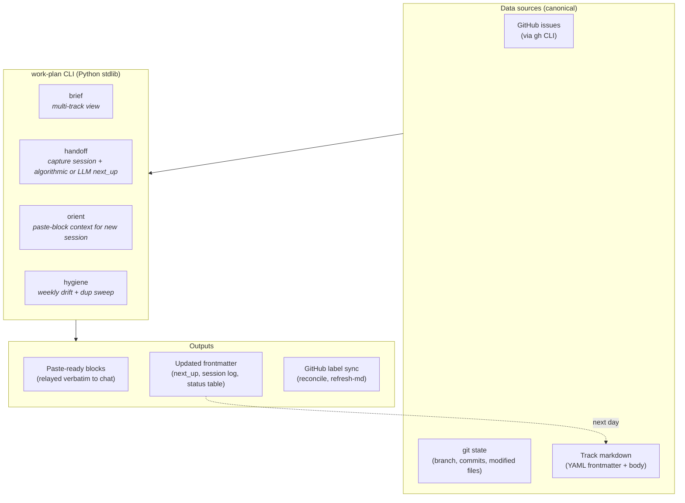

# work-plan toolkit


Track-aware daily work planning for developers running parallel Claude Code / Codex sessions across many GitHub issues.

`work-plan` is a CLI-backed agent skill (a pure-Python-stdlib CLI + `SKILL.md`). It treats your daily work as a set of *tracks* — each track is a markdown file with YAML frontmatter listing its priority, milestone, GitHub issue numbers, and current status. The skill derives state live from GitHub (`gh`), git, and the markdown body, so the markdown stays light (it references issues by ID rather than duplicating their state).

## Quick install

**Claude Code (recommended):**
```
/plugin marketplace add stylusnexus/agent-plugins
/plugin install work-plan@stylus-nexus
```
**Codex:** `codex plugin marketplace add stylusnexus/agent-plugins` → `codex plugin add work-plan@stylus-nexus`
**Cursor / Copilot / direct:** clone + `./install.sh` (see [Install](#install)).

Full multi-agent guide: the [**agent-plugins** marketplace README](https://github.com/stylusnexus/agent-plugins). See [Install](#install) below for details and the script path.

> **Command names:** examples below use the standalone form `/work-plan <subcommand>` (what `install.sh` gives you). **Installed as a plugin, commands are namespaced** — `/work-plan brief` → `/work-plan:brief`, `/work-plan handoff` → `/work-plan:handoff`, and the long tail is `/work-plan:run <subcommand>`. On Codex, invoke via `@work-plan` / `/skills`.

The five essentials you'll use 80% of the time are:

| Command | When |
|---|---|
| `/work-plan brief` | Morning. Multi-track snapshot — what's on your plate across every active track. Add `--repo=<key>` to scope to one project. |
| `/work-plan handoff <track>` | End of a work block. Captures what you touched. Use `--auto-next` for an algorithmic priority-sorted `next_up` (no LLM), `--set-next 1,2,3` for explicit numbers, or pair with Claude in chat for a curated pick. |
| `/work-plan orient <track>` | Switching context. ~15-line paste-block of priority / last session / next pick / git state — drop into a fresh Claude Code terminal. |
| `/work-plan reconcile <track> \| --all \| --repo=<key> [--draft]` | Track frontmatter membership drifted from GitHub labels. Use on label-driven tracks only — for hand-curated tracks, use `refresh-md` instead. `--draft` previews proposed ADDs/FLAGs without prompting or writing. `--repo=<key>` scopes the sweep to one repo. |
| `/work-plan hygiene [--repo=<key>]` | Weekly. Refresh status icons, reconcile labels, scan for duplicates. `--repo=<key>` scopes steps 1–2 to one repo (duplicates is global, so it's skipped in scoped mode). |

A dozen more subcommands cover slotting new issues into tracks, closing tracks (shipped/abandoned/parked), AI-clustering raw GitHub issues into thematic tracks, and one-time priority-label backfill.

Beyond issue tracking, **`plan-status`** answers a different question — *which of your accumulated plan/spec docs actually shipped, half-shipped, or died*. It correlates each plan's declared file-manifest (`Create:`/`Modify:`/`Test:` paths) against git and the filesystem rather than trusting checkboxes (which are routinely left unchecked even for shipped work). Read-only by default; optionally stamp the verdict into each doc (`--stamp`), get an AI verdict on prose/ambiguous docs (`--llm`), and act on the results behind confirmation gates (`--archive` dead plans, `--issues` for partial ones). See [Plan & doc liveness](#plan--doc-liveness-plan-status).

## How it works

The toolkit treats GitHub as the canonical source of issue state and never tries to mirror it. Track markdown files are lightweight references — they list issue numbers and a few pieces of derived metadata (priority, milestone, `next_up`, last session timestamp). The CLI re-derives everything else live from `gh`, `git`, and the markdown body.



**Daily rhythm**:

- **Morning** → `brief` shows multi-track plate, then `orient <track>` produces a ~15-line paste-block to drop into a fresh agent session.
- **End of work block** → `handoff <track>` captures what you touched. Three ways to set `next_up` for tomorrow:
  - `handoff <track> --auto-next` — algorithmic (no LLM): top-3 by priority then most-recently-updated, blockers excluded. Interactive `[Y/n/edit]` prompt — accept, edit, or skip.
  - `handoff <track> --set-next 4167,4148` — explicit numbers when you know exactly which issues are next.
  - Free-form via Claude in your agent session, which can review project memory and write a curated list back. The two `--*-next` flags are the no-LLM paths.
  - For tracks where you don't want to bother curating at all, set `next_up_auto: true` in the track's frontmatter — `brief` will then derive the list live each invocation, ignoring whatever's stored.
- **Weekly** → `hygiene` runs `refresh-md --all` + `reconcile --all` + `duplicates` in sequence to keep status icons, GitHub labels, and dedup state honest.
> **When does the body status table get refreshed?** `handoff` already rewrites the ✅/🔲 icons for its own track on every run (live `gh` fetch → `update_row_status`). `brief` reads GitHub state live and never relies on the body table, so it's always accurate. The only drift `refresh-md` exists to fix is *cross-track*: a track you haven't `handoff`'d recently whose icons fell behind because issues moved while you were heads-down on a sibling track. That's why `hygiene --all` sweeps it weekly.

## Plan & doc liveness (`plan-status`)

The track commands above are about *issues*. `plan-status` is about *documents* — the plans, specs, and design docs that pile up in a repo (especially the ones planning workflows like Superpowers generate) and then quietly **go to die**. Months later, nobody can tell what actually got built, what's half-done, and what was abandoned.

**The problem is specific and measurable: the checkboxes lie.** A plan's `- [ ]` / `- [x]` boxes are supposed to track completion, but the agent executing the plan tracks progress in its own scratchpad and rarely edits the file. So boxes stay empty even when the whole feature shipped. On one real repo, **134 of 140 shipped plans showed fewer than 25% of their boxes checked** — they looked abandoned; they were done.

`plan-status` ignores the checkboxes and reads a quieter, honest signal. A well-formed plan declares the **exact files it will create, modify, and test** — so every plan is really a *manifest of files that should exist*. The tool asks git and the filesystem: *of the files this plan promised, how many now exist and were committed?* That number is the real completion.

```
$ /work-plan plan-status --repo=myproject

# plan-status — /path/to/myproject
332 docs · 140 shipped · 20 partial · 172 manifest-less
lie-gap (shipped but <25% boxes checked): 134

## ✅ shipped (140)
  docs/plans/2026-03-16-idea-mode-ui.md
      9/9 declared files present (boxes stale)
  ...
## 🟡 partial (20)
  docs/plans/2026-05-01-v0.4.0-one-week-closeout.md
      19/40 declared files present
  ...
```

Each doc reaches one of these verdicts:

| Verdict | Meaning |
|---|---|
| ✅ **shipped** | (nearly) all declared files present — done, even if the boxes say otherwise |
| 🟡 **partial** | some files present — genuinely in progress; *this is your to-do list* |
| 💀 **dead** | no files, long untouched — an abandonment candidate |
| 👻 **manifest-less** | a prose doc with no file-manifest (e.g. a design spec) — needs a judgment call |
| 🧳 **foreign** | a misfiled plan whose declared files live in *another* repo — not this repo's work at all |

**Judging the ambiguous ones (`--llm`).** Prose specs (no manifest) and plans whose files look absent get a two-step AI pass: `--llm` gathers each candidate plus its git evidence and prints a prompt; you save the model's JSON verdicts to the cache; `--llm --apply` merges them in. The CLI never calls an LLM itself — same two-step contract as `group`/`suggest-priorities`.

**Acting on the results (gated).** Once you trust the verdicts:
- `--archive` moves 💀 dead plans into `archive/abandoned/` (history-preserving `git mv`).
- `--issues` opens a GitHub issue per 🟡 partial plan, listing its unsatisfied files.

Both are confirmation-gated and honor `--draft` (preview, zero side effects).

**Stamping (`--stamp`).** Add `--stamp` and the verdict is written *into the doc itself* as a small, idempotent header, so the truth lives next to the plan:

```markdown
# Idea Mode UI — Implementation Plan

<!-- plan-status: BEGIN -->
> **Status:** ✅ shipped · 9/9 files · last touched 2026-03-20
<!-- plan-status: END -->
```

The block is derived entirely from evidence (no timestamp), so re-stamping unchanged docs produces zero diff — run it as often as you like. `--draft` previews exactly which docs would change and writes nothing.

**Safety:** read-only by default — it mutates nothing unless you pass `--stamp`, `--archive`, or `--issues`, and those last two prompt before acting. Git is the only local state it touches, so stamps and archives are reversible with `git restore`. Point it at a repo with `--repo=<key>` (from your config) or just run it from inside the repo. In a Claude session you don't need the flags — ask in plain language ("*which plans in this repo are done vs unfinished?*", "*stamp the plan statuses*", "*archive the dead plans*") and the skill maps it to the right command.

## Requirements

The toolkit is a Python CLI that shells out to standard tools. You need **all four** installed before running `install.sh` / `install.ps1`:

| Tool | Min version | Why |
|---|---|---|
| Python | **3.9+** | The CLI itself. Uses PEP 585 generics (`list[dict]`, `dict[int, str]`), no 3.10+ features, no third-party libraries (stdlib only — no `pip install` step). |
| `gh` | recent | Live GitHub state queries (issues, milestones, labels). Must be authenticated: `gh auth login` once before first run. |
| `git` | any 2.x | Detects current branch, ahead-of-upstream count, modified files. |
| `yq` (mikefarah/yq, Go-based) | 4.x | Reads + edits YAML frontmatter and config. **Note**: Python `yq` (kislyuk/yq, the jq wrapper) won't work — install the Go version. |

Install per platform (one-liners):

```bash
# macOS (Homebrew)
brew install python@3 gh git yq

# Linux (Debian/Ubuntu)
sudo apt update && sudo apt install python3 git
# gh: https://github.com/cli/cli/blob/trunk/docs/install_linux.md
# yq: sudo wget -qO /usr/local/bin/yq https://github.com/mikefarah/yq/releases/download/v4.53.2/yq_linux_amd64 && sudo chmod +x /usr/local/bin/yq

# Linux (Arch)
sudo pacman -S python github-cli git go-yq

# Windows (PowerShell with winget)
winget install Python.Python.3 GitHub.cli Git.Git MikeFarah.yq
```

`install.sh` and `install.ps1` both verify all four are on `PATH` before doing anything else, and print install hints if any are missing.

After installing, authenticate `gh` once:

```bash
gh auth login   # follow the prompts; needs `repo` scope to read issues
```

## Compatible tools

A skill has two distinct contracts: (1) the underlying **CLI** that does the work, and (2) the **SKILL.md prompt-engineering** that tells the LLM how to use it (when to relay output verbatim, how to pick `next_up`, etc.). The CLI is portable; the prompt-engineering is model-specific. Honest split:

| Layer | What it is | Claude Code | Codex | Cursor | GitHub Copilot |
|---|---|---|---|---|---|
| **1. Python CLI** | `work_plan.py` + subcommands. Pure stdlib, shells out to `gh`/`git`/`yq`. | ✅ Proven | ✅ Proven | ✅ Direct invocation | ✅ Direct invocation |
| **2. Skill auto-discovery** | LLM client reads SKILL.md frontmatter, surfaces skill on relevant prompts | ✅ Proven via `~/.claude/skills/` | ⚠️ Per spec via `~/.agents/skills/` — **unverified** | ❌ No native skill system; use the Cursor shim (see below) | ❌ No native skill system; use the Copilot shim (see below) |
| **3. Instruction compliance** | Model follows prompt-engineered rules (verbatim relay, Claude-driven `next_up` flow, two-step AI subcommands) | ✅ Tested with Opus 4.x and Sonnet 4.x | ⚠️ Likely with GPT-4 class, may degrade with smaller models | ⚠️ Depends on which model Cursor is set to; less reliable than purpose-built skill systems | ⚠️ Copilot Chat models often ignore long context; basic CLI usage works, prompt-engineered behaviors don't |

### Install per platform

| Tool | Install command | Then invoke as |
|---|---|---|
| **Claude Code** | **Plugin (recommended):** `/plugin marketplace add stylusnexus/agent-plugins` → `/plugin install work-plan@stylus-nexus`. Or script: `./install.sh` / `.\install.ps1` | Plugin: `/work-plan:brief` … `/work-plan:run <sub>`. Script: bare `/work-plan <subcommand>` |
| **Codex** | **Plugin:** `codex plugin marketplace add stylusnexus/agent-plugins` → `codex plugin add work-plan@stylus-nexus`. Or script: `./install.sh --target=$HOME/.agents` | Plugin: `@work-plan` / `/skills`. Script: direct CLI |
| **Cursor** | Skip installer. Clone repo + copy `shims/cursor/work-plan.cursorrules` into your project's `.cursorrules` (or merge it in) | `python3 <toolkit>/skills/work-plan/work_plan.py <sub>` — alias `wp` recommended |
| **GitHub Copilot** | Skip installer. Clone repo + copy `shims/copilot/work-plan-copilot-instructions.md` into your project's `.github/copilot-instructions.md` (merge if it already exists) | Direct CLI as above |
| **Any other tool** | Skip installer. Just `git clone`. | Direct CLI |

Shell rc alias for the direct-CLI cases:

```bash
# bash/zsh (~/.bashrc, ~/.zshrc)
alias wp="python3 /path/to/work-plan-toolkit/skills/work-plan/work_plan.py"

# PowerShell ($PROFILE)
function wp { python "C:\path\to\work-plan-toolkit\skills\work-plan\work_plan.py" @args }
```

To install for **both** Claude Code AND Codex, run the installer twice with different `--target` values.

### What the shims do

For tools without a native skill system (Cursor, Copilot), `shims/` contains drop-in files that give the LLM the same prompt-engineered behavior the SKILL.md provides on Claude Code: condensed CLI usage, when to relay verbatim, the two-step AI subcommand pattern, and a pointer to the full toolkit docs.

The shims are **per-project** — copy them into each repo where you want the work-plan tool surfaced to your agent. They don't auto-load globally.

## Install

Pick the path for your tool. All three install the same CLI + skills.

### Claude Code (recommended) — plugin, easy updates

```
/plugin marketplace add stylusnexus/agent-plugins
/plugin install work-plan@stylus-nexus
```

Commands are namespaced under the plugin: `/work-plan:brief`, `/work-plan:handoff`,
`/work-plan:orient`, `/work-plan:hygiene`, `/work-plan:status`, and
`/work-plan:run <subcommand>` for everything else. Update with
`/plugin update work-plan@stylus-nexus`. Works in the CLI and the VS Code / JetBrains extensions.

### Codex — plugin

```
codex plugin marketplace add stylusnexus/agent-plugins
codex plugin add work-plan@stylus-nexus
```

### Cursor / direct / other — script

```bash
git clone <this-repo> work-plan-toolkit
cd work-plan-toolkit && ./install.sh          # macOS / Linux / WSL
# or, on Windows native PowerShell:  .\install.ps1
# or, for Codex's skills dir:        ./install.sh --target=$HOME/.agents
```

Gives the single bare `/work-plan <subcommand>` (no namespace). Re-run after `git pull` to refresh
(the plugin paths above update themselves).

The installer:

- **Copies** (not symlinks — for Windows compatibility) `skills/work-plan` and `skills/repo-activity-summary` into `~/.claude/skills/`
- Installs the `work-plan` launcher (`bin/work-plan` + `bin/work-plan.cmd` on Windows) and copies the standalone dispatcher (`installer/work-plan.md`) into `~/.claude/commands/work-plan.md` (the per-verb suite is plugin-only)
- **Self-seeds** `~/.claude/work-plan/config.yml` on first run if absent (one config home for every install mode), with `notes_root` at `~/.claude/work-plan/notes`
- Drops a `.installed-from` marker so `uninstall` knows what's safe to remove

External dependencies (verified by the installer): `gh`, `git`, `yq`, `python3`.

> **Versioning:** releases use CalVer (`YYYY.MM.DD+<sha>`, auto-bumped on deploy and synced into the plugin manifests) — not SemVer.

### What gets created

After clone, the toolkit looks like this:

```
work-plan-toolkit/
├── README.md
├── LICENSE
├── .gitignore
├── install.sh / install.ps1            # macOS+Linux+WSL / Windows
├── uninstall.sh / uninstall.ps1
├── skills/
│   ├── work-plan/
│   │   ├── SKILL.md
│   │   ├── work_plan.py                # CLI entry
│   │   ├── commands/                   # 16 subcommand modules
│   │   ├── lib/                        # config, frontmatter, gh, git, prompts, …
│   │   └── tests/                      # 234 unittest cases
│   └── repo-activity-summary/
│       └── SKILL.md                    # bundled companion skill
├── commands/
│   └── work-plan.md                    # Claude Code slash command alias
├── docs/
│   └── usage-examples.md
├── shims/                              # Drop-in instruction files for non-skill-aware tools
│   ├── README.md
│   ├── cursor/work-plan.cursorrules
│   └── copilot/work-plan-copilot-instructions.md
└── notes/
    └── README.md                       # default notes_root (empty until init-repo)
```

After running `install.sh` (or `install.ps1`), the installer creates this in your home directory:

```
~/.claude/
├── skills/
│   ├── work-plan/                      # copy of toolkit's skills/work-plan/
│   │   ├── SKILL.md
│   │   ├── work_plan.py
│   │   ├── commands/
│   │   ├── lib/
│   │   ├── tests/
│   │   └── .installed-from             # marker file (toolkit absolute path)
│   └── repo-activity-summary/
│       ├── SKILL.md
│       └── .installed-from             # marker file
├── commands/
│   └── work-plan.md                    # copy of toolkit's commands/work-plan.md
└── work-plan/
    └── config.yml                      # seeded from template, notes_root resolved
                                        # to absolute toolkit path (edit this one)
```

Then, when you run `/work-plan init-repo myproject --github=your-org/myproject`, the toolkit's `notes/` folder gets a per-repo subdir (under whatever `notes_root` resolves to):

```
<notes_root>/
└── myproject/                          # created by init-repo
    ├── archive/
    │   ├── shipped/.gitkeep            # close mv's shipped tracks here
    │   └── abandoned/.gitkeep          # close mv's abandoned tracks here
    └── <track-slug>.md                 # active tracks live at top level
```

## Configure

After install, bootstrap your first repo with the **`init-repo`** subcommand:

```bash
/work-plan init-repo myproject --github=your-org/myproject --local=/path/to/checkout
```

This creates `<notes_root>/myproject/archive/{shipped,abandoned}/` and adds the repo block to your `~/.claude/work-plan/config.yml` (idempotent; errors if the key already exists). Skip `--github` / `--local` to be prompted interactively.

You can also edit `~/.claude/work-plan/config.yml` directly:

```yaml
notes_root: /absolute/path/to/your/notes/    # or keep the bundled default
repos:
  myproject:
    github: your-org/myproject
    local: /path/to/local/checkout           # optional, enables in-progress detection
```

### Where your config lives

The active config the skill reads is **`~/.claude/work-plan/config.yml`** — created by `install.sh` (or `install.ps1`) on first run. There's no template file in the repo to confuse with the runtime config; install just writes the right two lines directly.

After a fresh install, it looks like:

```yaml
# work-plan config — created by install.sh. Edit this file to customize.
# Run /work-plan init-repo <key> --github=<org/repo> to populate repos:.
notes_root: /absolute/path/to/work-plan-toolkit/notes
repos: {}
```

`notes_root` is the **absolute path of the toolkit's bundled `notes/` folder**, so the default works out of the box. To change it (e.g., to `~/Documents/Project Notes/`), edit this file.

The bundled `notes/` folder stays empty until you run `/work-plan init-repo <key>`, which adds a per-repo subdir + writes the repo block back into this same config file via `yq`.

## Security & data handling

- **No credentials stored.** All GitHub access goes through your existing `gh auth`. This toolkit never reads, writes, or stores GitHub tokens.
- **Local-only writes.** The skill writes to `~/.claude/skills/work-plan/`, `~/.claude/skills/repo-activity-summary/`, `~/.claude/commands/work-plan.md`, `~/.claude/work-plan/config.yml`, and your `notes_root`. The exceptions are the `plan-status` action flags, all confined to the repo you point it at and all opt-in: `--stamp` writes a status header into discovered plan docs; `--archive` `git mv`s dead plans into `archive/abandoned/`; `--issues` opens GitHub issues for partial plans (via `gh`). All honor `--draft` (preview, no writes) and the two mutating actions prompt for confirmation. Nothing else.
- **No telemetry, no network calls beyond `gh`.** All GitHub operations go through `gh` (your authenticated session); no direct HTTP requests are made.
- **AI subcommands (`group`, `suggest-priorities`) send issue titles to Claude** via Claude Code's existing integration. Body content, code, and PR contents are NOT sent. If your repo is private and you're cautious about what reaches the model, skip these subcommands.
- **`init-repo` writes to your config via `yq -i`.** Inputs are JSON-encoded before being passed to `yq`, so a maliciously crafted `--github=` value can't break out of the YAML edit.
- **`install.sh` / `install.ps1` only touch user-owned dirs.** No `sudo`, no system-wide changes, no privilege escalation.

For vulnerability reporting, threat model, and past advisories, see [SECURITY.md](./SECURITY.md).

## Usage walkthrough

See `docs/usage-examples.md` for end-to-end scenarios (morning brief, mid-work handoff, fresh-session orient, weekly hygiene).

## Subcommand reference

| Subcommand | What it does |
|---|---|
| `brief [--repo=<key>]` | Multi-track snapshot of all active tracks across configured repos. `--repo=<key>` filters to one project (matches the folder name under `notes_root` or the `org/repo` GitHub slug; archived-reopen callouts are also scoped). |
| `handoff <track> [--auto-next \| --set-next 1,2,3]` | Wrap up a work block. Writes a `### Session — <ts>` entry. `--auto-next` suggests a priority-sorted top-3 from open issues (interactive: apply / edit / skip). `--set-next 1,2,3` is the explicit form. Without either flag, just captures the session summary and reads any pre-existing `next_up`. |
| `orient [track]` (alias: `where-was-i`) | Read-only paste block. With a track name: ~15-line track summary (priority, last session, next pick, git state). With no track: cwd snapshot (branch, recent commits, modified files) for non-track work. Add `--pick` for the interactive track picker. |
| `slot <issue-num> [track]` | A new GitHub issue should belong to a track — adds it to the track's `github.issues` list. |
| `close <track>` | Mark track shipped, parked, or abandoned. Moves to `archive/<state>/` for shipped/abandoned. |
| `refresh-md <track>` `\|` `--all` `\|` `--repo=<key>` | Update issue STATE (open/closed, status labels) inside the track body's status table. Does NOT change track membership — this is the right tool for "refresh the work I just completed." `--all` sweeps every active track; `--repo=<key>` scopes the sweep to one repo. |
| `hygiene [--repo=<key>]` | Weekly all-in-one: `refresh-md` + `reconcile` + `duplicates`. With `--repo=<key>`, steps 1 and 2 scope to that repo and the global `duplicates` step is skipped. |
| `list [--all]` | List active tracks (or all including parked/archived). |
| `init <path>` | Add frontmatter to a brand-new track .md file. |
| `init-repo <key> [--github=<slug>] [--local=<path>]` | Bootstrap a new repo: create `<notes_root>/<key>/archive/{shipped,abandoned}/` and add the repo block to your config. |
| `suggest-priorities --repo=<key>` | Two-step AI label backfill: CLI fetches unlabeled issues, Claude proposes priorities, `--apply` writes labels via `gh`. |
| `group [--milestone=X] [--label=Y]` | AI-cluster GitHub issues into thematic tracks (creates `<repo>/<slug>.md` per cluster). |
| `reconcile <track>` `\|` `--all` `\|` `--repo=<key> [--draft]` | Update track MEMBERSHIP (the `github.issues` list in frontmatter) by syncing against a GitHub label. Read-only on GitHub. Default label is `track/<slug>`; override per-track via `github.labels: [...]` in frontmatter (OR semantics). `--draft` previews ADDs/FLAGs without prompting or writing. `--repo=<key>` scopes the sweep to one repo. NOT for hand-curated tracks (it'll propose dropping curated issues every run) — use `refresh-md` if you only want to update issue state. When >50% of frontmatter issues lack the label, reconcile prints a hint pointing to `refresh-md`. |
| `duplicates [--repo=<key>]` | Find likely-duplicate issues by title similarity (stdlib `difflib`). Prints `gh issue close` consolidation commands. |
| `canonicalize <track>` | Add a canonical issue table to a track file (so `refresh-md` knows where to update). |
| `plan-status [--repo=<key>] [--json] [--stamp [--draft]] [--llm [--apply]] [--archive \| --issues] [--draft]` | Reach a verdict on every plan/spec doc in a repo by correlating its declared file-manifest against git + the filesystem: ✅ shipped / 🟡 partial / 💀 dead / 👻 manifest-less / 🧳 foreign. Read-only by default. `--stamp` writes an idempotent status header into each doc (`--draft` previews); `--llm` runs a two-step AI verdict on prose/ambiguous docs; `--archive` moves dead plans to `archive/abandoned/` and `--issues` opens issues for partial plans (both gated, both honor `--draft`); `--json` for machine output. |

Run `python3 ~/.claude/skills/work-plan/work_plan.py --help` for the full list with examples.

## Version

```bash
python3 ~/.claude/skills/work-plan/work_plan.py --version
# work-plan 2026.04.30+a1b2c3d
```

The version is **calver + git short SHA** of the deploy commit on `main`. It's auto-bumped on every push to main by `.github/workflows/version-bump.yml` — there's no hand-maintained version constant. Re-running `./install.sh` (or `.\install.ps1`) after a `git pull` refreshes the value in your installed copy. Include this string in any bug report so the maintainer knows exactly which commit you're on.

## Composes with

- **`/repo-activity-summary`** (bundled) — Global "what's open across the whole repo" view. Use when you need a wider lens than per-track.
- For non-track-bound work (you're in a directory but no track exists yet for what you're doing), run `/work-plan orient` with no track arg — it falls through to a cwd snapshot of branch + recent commits + modified files. No external skill needed.

## Philosophy

- **Derive, don't duplicate.** GitHub is canonical for issue state; markdown references issues by ID. The skill queries `gh` live and synthesizes the answer rather than caching what `gh` already knows.
- **Session-bootstrap commands output paste blocks, not data dumps.** `orient` returns ~15 lines you can drop into a fresh Claude Code terminal with full context. Never bury the suggested next move under historical noise.
- **Track files are durable across parallel sessions.** Five Claude Code terminals open on five different tracks shouldn't conflict — each session reads/writes its own track file, and the frontmatter `last_handoff` timestamp lets you tell which session last touched a track.
- **Heuristic priority backfill is one-shot, not continuous.** `suggest-priorities` is a migration tool; once issues are labeled, GitHub stays canonical. The skill doesn't reclassify on every run.

## Testing

```bash
cd skills/work-plan
python3 -m unittest discover tests
```

234 tests, no external dependencies (mocks `gh`/`git` calls).

## License

MIT — see `LICENSE`.

## Maintainer

Stylus Nexus Holdings LLC · [@stylusnexus](https://github.com/stylusnexus)
