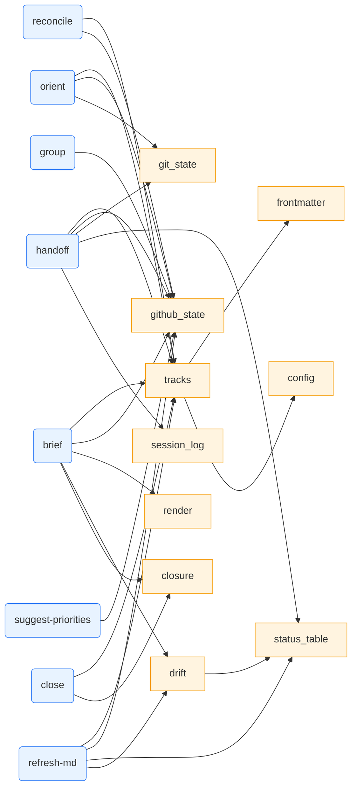

# Component Reference

> Companion to: [overview.md](overview.md) · [data-flow.md](data-flow.md)

Per-module breakdown of `skills/work-plan/`. The full canonical user-facing description of each subcommand lives in `work_plan.py` (`DESCRIPTIONS` list) and `SKILL.md` — this doc covers internal structure only.

## Top-level layout

```
work-plan-toolkit/
├── .claude-plugin/plugin.json   # Claude plugin manifest (version = CalVer)
├── .codex-plugin/plugin.json    # Codex plugin manifest ("skills": "./skills/")
├── bin/work-plan(.cmd)          # self-locating CLI launcher (PATH entry under a plugin)
├── commands/                    # plugin command suite (brief/handoff/orient/hygiene/status/run)
├── installer/work-plan.md       # standalone dispatcher (install.sh copies this; plugin-excluded)
├── skills/work-plan/
│   ├── work_plan.py             # Dispatcher. SUBCOMMANDS dict + DESCRIPTIONS help text.
│   ├── SKILL.md                 # LLM-facing usage rules (verbatim relay, next_up flow, ...).
│   ├── commands/                # 16 subcommand modules. Each exports `run(args) -> int`.
│   └── lib/                     # 20 shared helpers. Pure stdlib, importable from any command.
└── skills/repo-activity-summary/SKILL.md
```

**Two `commands/` dirs, distinct roles:** the repo-root `commands/` holds the **plugin** command
suite (namespaced `/work-plan:brief` …, thin wrappers over the `bin/work-plan` launcher);
`skills/work-plan/commands/` holds the **CLI subcommand modules** (the actual logic). See
[Plugin packaging](#plugin-packaging).

## `work_plan.py` (dispatcher)

The entry point. Three responsibilities:

1. Map subcommand name → module path (`SUBCOMMANDS` dict). Supports both `brief` and `--brief` forms; flag-style aliases exist for the four essentials (`--brief`, `--handoff`, `--orient`, `--hygiene`).
2. Print rich help (`--help` / `-h` / no args) using the hand-maintained `DESCRIPTIONS` list — this is the user-facing reference, not auto-generated.
3. Dynamic-import the chosen module and call `module.run(argv[2:])`.

**Adding a subcommand**: write `commands/<name>.py` with `def run(args: list[str]) -> int`, register in BOTH `SUBCOMMANDS` and `DESCRIPTIONS`. Forgetting `DESCRIPTIONS` makes the subcommand work but leaves it undocumented in `--help`.

## `commands/` — subcommand modules

Each module is thin orchestration over `lib/`. Sizes are an honest signal of complexity:

| Module | LOC | Role |
|---|---:|---|
| `handoff.py` | 595 | The most complex command. Derives recent commits attributable to a track (two attribution paths: explicit branches, or scan-and-filter by `#NNNN` mentions), uncommitted files (only if current branch belongs to this track), GitHub-closed-since-last-handoff, and a "fresh-session prompt" copy block. Also has an `--interactive` legacy mode and `--set-next` for Claude-driven `next_up` persistence. |
| `where_was_i.py` | 302 | `orient`. Track-mode: ~15-line paste block (priority, last session, next pick, git state). No-arg cwd-mode: branch + recent commits + modified files for non-track work. `--pick` forces an interactive picker. |
| `group.py` | 223 | Two-step AI clustering: step 1 fetches GitHub issues + writes a clustering prompt; step 2 (`--apply`) reads `/tmp/work_plan_groups.answers.json` written by the surrounding LLM and creates `<repo>/<slug>.md` track files. |
| `brief.py` | 199 | Multi-track snapshot. Walks tracks, fetches GitHub state per track, applies time-aware framing (`lib/render.py`), prints sorted by priority. Output is the deliverable — verbatim relay required. |
| `suggest_priorities.py` | 124 | Two-step AI label backfill: step 1 fetches unlabeled issues + prompts for `priority/PN` labels; step 2 (`--apply`) calls `gh issue edit --add-label`. Mirrors the structure of `group.py`. |
| `canonicalize.py` | 123 | Inserts a `<!-- canonical-issue-table -->` marker + table at the top of a track's body, so subsequent `refresh-md` calls target only that table and leave narrative tables alone. |
| `duplicates.py` | 111 | stdlib `difflib` similarity scan over open issue titles. Prints `gh issue close` consolidation commands. |
| `refresh_md.py` | 110 | Sync canonical body status table with current GitHub state. `--all` sweeps every active track. |
| `reconcile.py` | 98 | Sync track frontmatter with `track/<slug>` GitHub labels (label-as-source-of-truth direction). |
| `init_repo.py` | 90 | Bootstrap: create `<notes_root>/<key>/archive/{shipped,abandoned}/` + add a repo block to `~/.claude/work-plan/config.yml` via `yq -i`. JSON-encodes inputs to prevent YAML injection. |
| `plan_status.py` | ~210 | Doc/plan **liveness**: correlate each plan's declared file-manifest (`Create:`/`Modify:`/`Test:` paths) against git + filesystem to verdict it shipped / partial / dead / orphaned — rather than trusting checkboxes. `--stamp` writes the verdict into the doc; `--llm` is a two-step AI verdict for prose docs; `--archive`/`--issues` act behind gates. Read-only by default. Backed by the `manifest`/`verdict`/`doc_discovery`/`status_header`/`llm_evidence`/`reconcile_actions` lib modules. |
| `slot.py` | 81 | Add an issue number to a track's `github.issues` list. Dedupes. |
| `init.py` | 66 | Add YAML frontmatter to a brand-new track `.md` file. |
| `close.py` | 56 | Mark a track shipped/parked/abandoned. Moves to `archive/<state>/` for shipped/abandoned. |
| `hygiene.py` | 51 | Wrapper: invokes `refresh_md.py --all` + `reconcile.py --all` + `duplicates.py` in sequence. |
| `list_cmd.py` | 39 | List active tracks. `--all` includes parked/archived. |

## `lib/` — shared helpers

| Module | LOC | Purpose | Used by |
|---|---:|---|---|
| `tracks.py` | 98 | `discover_tracks(cfg)` walks `notes_root/` and builds `Track` dataclasses. `find_track_by_name` is the canonical resolver — every command that takes a track arg uses it. | every command that operates on tracks |
| `frontmatter.py` | 48 | `parse_file` / `write_file` for YAML-frontmattered markdown. Preserves body exactly. Shells out to `yq` for YAML I/O (keeps stdlib-only invariant). | every command that edits tracks |
| `config.py` | 59 | Loads `~/.claude/work-plan/config.yml`. Normalizes legacy string-shape repo entries to dict shape. Exposes `resolve_github_for_folder`, `resolve_local_path_for_folder`. | all commands |
| `github_state.py` | 63 | `fetch_issues(repo, nums)` — wraps `gh issue view --json`. Defines `PRIORITY_LABELS` and `state_to_status_label`. | brief, handoff, orient, refresh-md, reconcile, suggest-priorities, group |
| `git_state.py` | 130 | `current_branch`, `has_uncommitted`, `commits_ahead`, `last_commit_date`, `branch_exists`, plus time helpers (`gap_seconds_to_label`, `parse_iso_timestamp`). Always runs git with `-C <path>` — never depends on cwd. | handoff, orient, brief, close |
| `status_table.py` | 122 | Find + edit the canonical markdown status table in a track body. Distinguishes "first table with issue refs" from "first table that happens to have a Status column". `find_canonical_status_tables` honors the `<!-- canonical-issue-table -->` marker placed by `canonicalize`. | handoff, refresh-md, drift |
| `session_log.py` | 39 | `append_session_log` writes `### Session — <ts>` blocks under the `## Session log` header. | handoff |
| `closure.py` | 72 | `is_closure_ready(signals)` — 5-signal gate (all issues closed, all branches done, `next_up` empty, cold 14d, no recent related issues). | close, brief |
| `drift.py` | 32 | `detect_drift(body, github_issues)` — compare body status icons (✅/🔲) with GitHub state. | brief, refresh-md |
| `new_issues.py` | 45 | Match recent GitHub issues to existing tracks by `track/<slug>` label or title-word fuzzy match. | brief, handoff |
| `render.py` | 74 | Output composers: `time_aware_framing`, `render_track_row`. Keeps presentation logic out of command modules. | brief |
| `prompts.py` | 68 | `prompt_input`, `prompt_lines`, `prompt_yes_no`, `parse_flags`. **Use these — don't reinvent.** | every interactive command |
| `next_up.py` | ~50 | `suggest_next_up` — priority-then-recency ordering of open non-blocker issues for `handoff --auto-next`. | handoff |
| `manifest.py` | 164 | Parse a plan's declared `Create:`/`Modify:`/`Test:` file paths; score each against git + filesystem. The mechanical spine of `plan-status`. | plan-status |
| `verdict.py` | 51 | Pure verdict logic (shipped / partial / dead / orphaned) from manifest satisfaction + checkbox/age signals. No I/O. | plan-status |
| `doc_discovery.py` | 41 | Find plan/spec docs per configured globs; classify manifest-bearing vs prose. | plan-status |
| `status_header.py` | 60 | Idempotent BEGIN/END verdict-header stamping into a doc (`--stamp`). | plan-status |
| `llm_evidence.py` | 45 | Build the two-step LLM prompt + read back the verdict JSON for prose/ambiguous docs (`--llm`). | plan-status |
| `reconcile_actions.py` | 34 | Gated archive/issue actions for dead/partial plans (`--archive`/`--issues`). | plan-status |

`status_table.py` also gained `render_issue_row` / `append_rows` / `sync_missing_rows` (issue #77/#79):
refresh-md and handoff now **append** rows for frontmatter issues missing from the canonical table
(in frontmatter order), not just update existing cells.

## Command → lib dependency cheat-sheet



(Most commands also use `prompts.py` for `parse_flags`; omitted from the diagram for clarity.)

## Tests

Mirror of `commands/` and `lib/` under `skills/work-plan/tests/` — **~250 cases across ~42 files**. All `gh` / `git` subprocess calls are mocked via `unittest.mock`. The suite is offline, finishes in a couple of seconds, and uses pure stdlib `unittest` (no `pytest`). A separate repo-root `tests/test_bin_wrapper.py` exercises the `bin/work-plan` launcher (Linux/macOS in CI).

Notable test files:

- `test_handoff_set_next.py` — covers the `--set-next` flag round-trip (the LLM's persistence path for `next_up`).
- `test_status_table.py` — table parsing edge cases including narrative-vs-canonical distinction.
- `test_drift.py` — drift detection across emoji / text status formats.
- `test_smoke.py` — module imports and dispatcher returns `2` on no-args.
- `tests/fixtures/` — sample track markdown files used by table-parsing tests.

## Plugin packaging

The toolkit is also distributed as plugins (one repo, two manifests) — the human/agent delivery layer over the same CLI:

- **`.claude-plugin/plugin.json`** / **`.codex-plugin/plugin.json`** — manifests; `version` = the CalVer `VERSION`, synced into both by `.github/workflows/version-bump.yml` on deploy. The Codex manifest declares `"skills": "./skills/"`.
- **`bin/work-plan`** (+ `bin/work-plan.cmd` for Windows) — launcher that resolves `work_plan.py` relative to itself (plugin cache), then `${CLAUDE_PLUGIN_ROOT}`/`${PLUGIN_ROOT}`/`~/.claude`/`~/.agents`. Plugins put `bin/` on PATH automatically.
- **`commands/*.md`** (repo root) — the namespaced command suite (`/work-plan:brief` …); each is a thin wrapper calling the launcher with unquoted `$ARGUMENTS`. The standalone dispatcher is kept **out** of this dir (in `installer/work-plan.md`) to avoid a `work-plan` command/skill name collision; `install.sh` copies only that one.
- **Marketplace:** the separate `stylusnexus/agent-plugins` repo carries a per-host index — `.claude-plugin/marketplace.json` (Claude; `source: github`) and `.agents/plugins/marketplace.json` (Codex; `source: url` + `policy` + `category`, because Codex can't parse Claude's source form). Both pin a release tag.
- **Config seeding** moved into the CLI (`lib/config.py::ensure_config`, called by `load_config`) so plugin installs — which run no install hook — still get a config on first run, at one home `~/.claude/work-plan/`.
- **Planned:** `work-plan export --json` (spec #2) — the stable read surface for the VS Code viewer (#87).

## Companion skill: `skills/repo-activity-summary/`

A single-file skill (`SKILL.md` only — no Python). Pure prompt engineering on top of three `gh` commands run in parallel: `gh issue list`, `gh pr list`, `gh run list`. Used as a global "what's open across the whole repo" view, complementary to the per-track `work-plan` lens.
