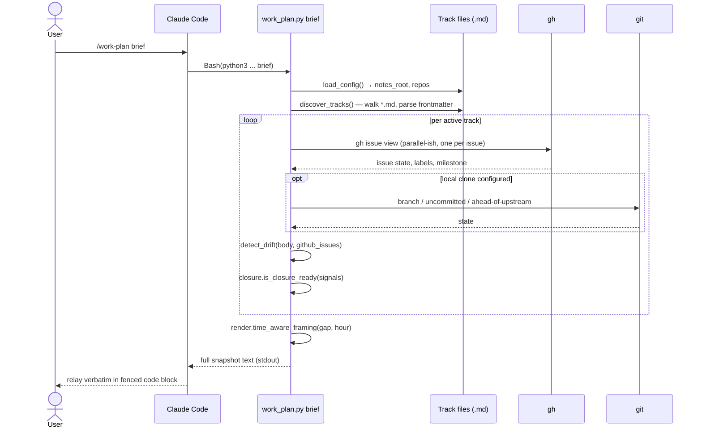
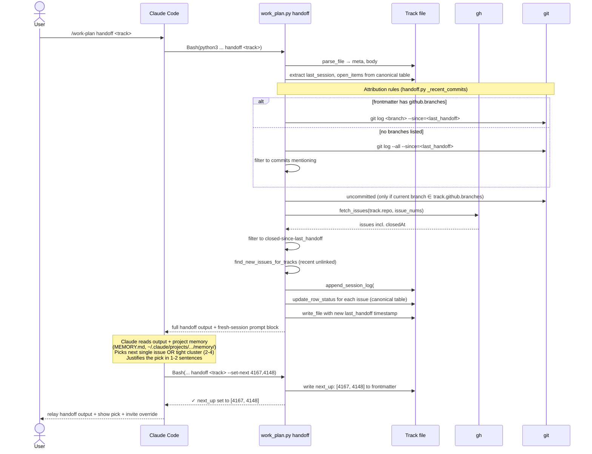
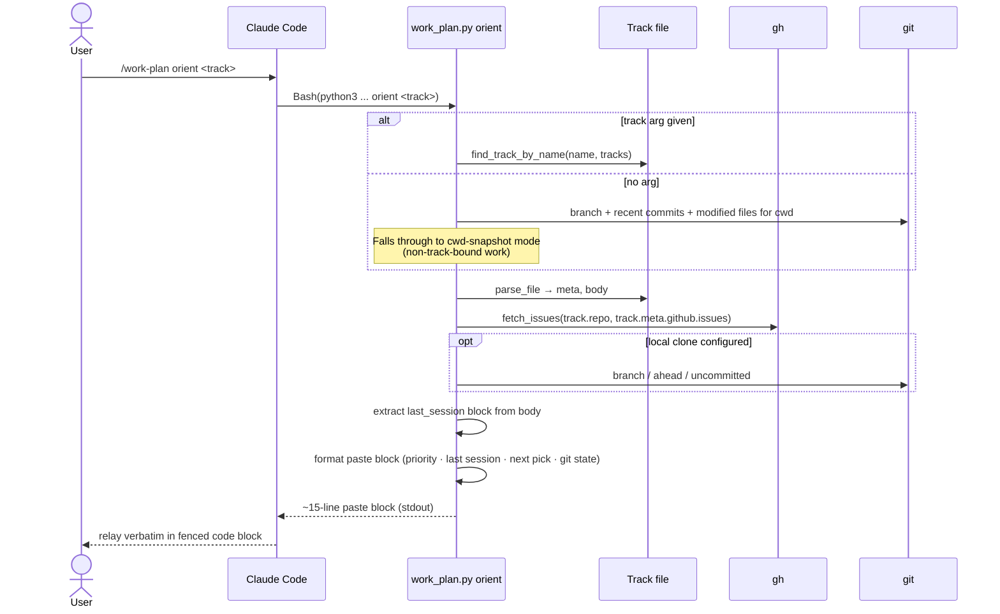
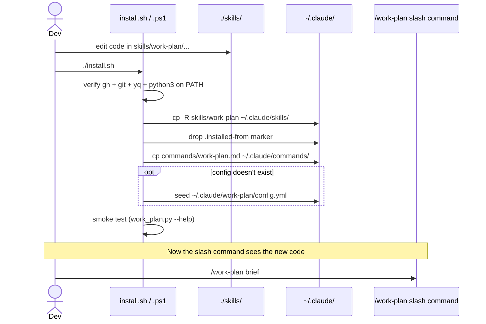

# Data Flow

> Companion to: [overview.md](overview.md) · [components.md](components.md)

Sequence diagrams for the four flows that carry the most complexity:

1. [`brief`](#brief--multi-track-snapshot) — multi-track snapshot
2. [`handoff`](#handoff--with-claude-driven-next_up) — wrap up a work block + Claude-driven `next_up`
3. [`orient` (track mode)](#orient--track-mode) — re-orient on a track
4. [Two-step AI subcommands](#two-step-ai-subcommands-group--suggest-priorities) — `group` and `suggest-priorities`

A brief note on the lifecycle gap is at the [end](#install-time-vs-run-time).

---

## `brief` — multi-track snapshot

Read-only. Walks every track, hits GitHub for state, and prints a sorted snapshot. Output is the deliverable — the LLM relays it verbatim into chat.



**Why `gh` per issue, not per repo**: tracks reference specific issue numbers; fetching only those is cheaper than `gh issue list` and avoids label-filter drift.

---

## `handoff` — with Claude-driven `next_up`

The most complex flow in the system. The CLI does the deriving; the LLM does the picking. Two CLI invocations bracket one LLM reasoning step.



**Body-first principle**: when `git`/`gh` data is missing or unattributable, the output still lands meaningfully because the canonical body table + last session log are always available. See `handoff.py:_open_items_from_canonical`.

**Branch-attribution conservatism**: if no branches are listed in frontmatter and the current branch isn't recognized, `_uncommitted_files` returns empty rather than misattributing another track's work-in-progress. This is deliberate — false attribution is worse than missing data.

---

## `orient` — track mode

Read-only. Produces a ~15-line paste block designed to be pasted into a fresh terminal in another Claude Code session. No writes.



The cwd-fallthrough is what makes `orient` viable for non-track work — drop into a directory that isn't yet a track, run `/work-plan orient`, get a useful snapshot anyway.

---

## Two-step AI subcommands (`group` / `suggest-priorities`)

Both run as **CLI → LLM → CLI** with a `/tmp/` JSON file as the handoff format. The CLI never makes an LLM call directly.

```mermaid
sequenceDiagram
    actor User
    participant LLM as Claude Code
    participant CLI as work_plan.py
    participant gh
    participant Tmp as /tmp/work_plan_*.answers.json

    User->>LLM: /work-plan group --milestone=v1.0.0
    LLM->>CLI: Bash(... group --milestone=v1.0.0)
    CLI->>gh: gh issue list (matching milestone/label/repo)
    gh-->>CLI: issues (number + title only)
    CLI-->>LLM: prompt block: "cluster these issues into thematic tracks; write JSON to /tmp/work_plan_groups.answers.json"

    Note over LLM: Read titles, decide clusters,<br/>generate slug + member-issue-list per cluster
    LLM->>Tmp: Write tool → JSON
    LLM-->>User: show proposed clusters BEFORE applying

    User->>LLM: looks good
    LLM->>CLI: Bash(... group --apply)
    CLI->>Tmp: read JSON
    CLI->>CLI: write <repo>/<slug>.md per cluster<br/>(frontmatter + canonical issue table)
    CLI-->>LLM: ✓ created N tracks
    LLM-->>User: confirmation
```

Identical structure for `suggest-priorities`, except the JSON contains `{issue_num: "P0|P1|P2|P3"}` and `--apply` runs `gh issue edit --add-label priority/PN`.

**Privacy note**: only issue **titles** are sent to the model. Issue bodies, code, and PR contents are not.

---

## Install-time vs run-time

The flows above describe **run-time** — what happens when a subcommand executes. The **install-time** path is separate and only relevant when developing the toolkit itself:



This is what the [overview](overview.md#two-distinct-lifecycles) refers to as the source-vs-runtime gap. Direct CLI invocation (`python3 skills/work-plan/work_plan.py ...`) bypasses this gap entirely and is the recommended dev-loop shortcut.
