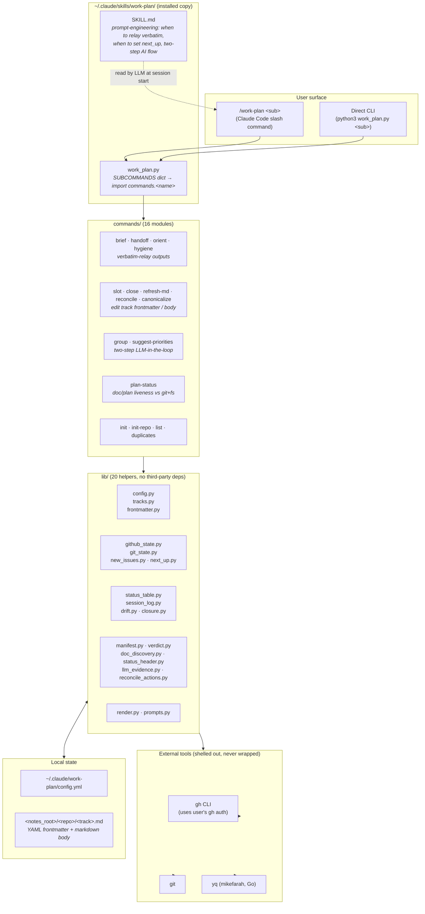
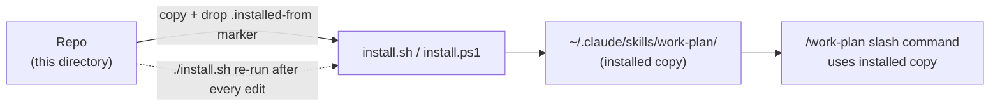

# Architecture Overview

> Companion to: [README.md](../../README.md) · [CLAUDE.md](../../CLAUDE.md) · [skills/work-plan/SKILL.md](../../skills/work-plan/SKILL.md)
> See also: [components.md](components.md) · [data-flow.md](data-flow.md)

## What this is

A pure-Python CLI with multiple delivery faces. The **CLI is the single engine**; everything else is a face on it:

- a **Claude Code plugin** and a **Codex plugin** (one repo, two manifests — `.claude-plugin/` and `.codex-plugin/`), distributed via the `stylusnexus/agent-plugins` marketplace;
- a **`SKILL.md`** that teaches the LLM when to invoke the CLI and how to relay output;
- the legacy **`install.sh`/`install.ps1`** script path for Cursor / Copilot / direct-CLI users;
- a **planned VS Code viewer** (issue #87) that reads `work-plan export --json` and writes by shelling to the CLI.

The CLI is portable to any shell; the plugin/skill discovery layers on top. Whatever the face, the rules (tier choice, the public-repo heads-up, frontmatter↔table sync, GitHub-as-canonical) live in the one CLI — no logic is duplicated per face.

## Technology stack

| Layer | Implementation |
|---|---|
| CLI runtime | Python 3.9+, **stdlib only** (no `pip install` step). Argparse-style dispatching done by hand. |
| YAML I/O | Shells out to **mikefarah `yq`** (Go binary). Used in two places: `lib/config.py` (read config) and `lib/frontmatter.py` (read/write track frontmatter). |
| Git access | Shells out to `git` (`lib/git_state.py`). |
| GitHub access | Shells out to `gh` CLI (`lib/github_state.py`, `lib/new_issues.py`). The toolkit never calls the GitHub REST API directly — `gh auth` is the only credential surface. |
| LLM access | None directly. Two-step subcommands (`group`, `suggest-priorities`) print a prompt to the terminal and rely on the surrounding agent (Claude Code, Codex, etc.) to write JSON to `/tmp/`. The CLI then re-reads it on `--apply`. |
| Distribution | **Plugin (recommended):** `stylusnexus/agent-plugins` marketplace with a per-host index — `.claude-plugin/marketplace.json` (Claude) and `.agents/plugins/marketplace.json` (Codex; Codex can't parse Claude's source form, so it needs its own). Manifests `.claude-plugin/plugin.json` + `.codex-plugin/plugin.json`, version = CalVer synced by `version-bump.yml`. |
| Installer (script path) | `install.sh` (bash) + `install.ps1` (PowerShell), in lockstep. Copies skills into `~/.claude/skills/`, installs the `bin/work-plan` launcher (+ `bin/work-plan.cmd` on Windows), copies the standalone dispatcher from `installer/work-plan.md`, and **self-seeds** config via the CLI (one home: `~/.claude/work-plan/`). |
| CLI launcher | `bin/work-plan` — resolves `work_plan.py` relative to itself (works in the plugin cache, `~/.claude`, `~/.agents`). Plugin installs get `bin/` on PATH automatically. |
| Tests | `unittest` from stdlib. **~250 cases across ~42 files** under `skills/work-plan/tests/`, plus `tests/test_bin_wrapper.py` at the repo root. All `gh` / `git` calls are mocked; offline. |

## High-level architecture



## Delivery modes

There are three ways the CLI reaches a user; all run the same `work_plan.py`:

| Mode | Install | Where the code lives | Invoke |
|---|---|---|---|
| **Claude plugin** (recommended) | `/plugin install work-plan@stylus-nexus` | `~/.claude/plugins/cache/stylus-nexus/work-plan/<ver>/` | `/work-plan:brief` … `/work-plan:run <sub>` (namespaced) |
| **Codex plugin** | `codex plugin add work-plan@stylus-nexus` | `~/.codex/plugins/cache/…` | `@work-plan` / `/skills` |
| **Script** (Cursor/direct) | `./install.sh` / `.\install.ps1` | `~/.claude/skills/work-plan/` | bare `/work-plan <sub>` or `python3 …/work_plan.py` |

The `bin/work-plan` launcher resolves the CLI in any of these layouts. The `export --json` read surface (planned, spec #2) is what the VS Code viewer (#87) will consume.

## Source vs runtime (script-install gap)

The toolkit has a meaningful gap between **source** and **runtime** for the script path:



**Implication for development**: editing files in this repo does not affect the running `/work-plan` command. After every change you want to test through the slash command, re-run `./install.sh`. To skip that gap during development, invoke the CLI directly (`python3 skills/work-plan/work_plan.py <sub>`) — it doesn't need to be installed to run.

## Data model: derive, don't duplicate

GitHub is canonical for issue state. Track markdown files are lightweight references — they list issue numbers in YAML frontmatter, plus a few derived fields (`priority`, `milestone`, `next_up`, `last_handoff` timestamp). Every CLI invocation re-derives state live from `gh` / `git` / the markdown body. There is no cache, no database, no sync job.

Track frontmatter shape (canonical example):

```yaml
---
track: ux-redesign                  # slug, also matches filename stem
status: active                      # active | in-progress | blocked | parked | shipped | abandoned
launch_priority: P1
milestone_alignment: v1.0.0
github:
  repo: stylusnexus/myproject
  issues: [4167, 4148, 4149]        # all issues this track tracks
  branches: [feat/ux-overhaul]      # optional; enables git attribution in handoff
next_up: [4167]                     # what to pick up next session
last_touched: 2026-04-29T09:14
last_handoff: 2026-04-28T18:02
---
```

The body is freeform markdown, but `commands/` care about two specific structures: a **canonical issue table** (parsed by `lib/status_table.py`) and a **session log** section (`## Session log` with `### Session — <ts>` entries appended by `lib/session_log.py`).

## Cross-platform / cross-tool surface

Two parallel installer pairs (`install.sh` ↔ `install.ps1`, `uninstall.sh` ↔ `uninstall.ps1`) must stay in lockstep — they implement the same auto-detection (`~/.claude` for Claude Code, `~/.agents` for Codex), the same dependency check (`gh`, `git`, `yq`, `python3`), the same config seeding, and the same `.installed-from` marker semantics for safe overwrites. Launcher ownership additionally requires a stable product marker whose recorded SHA-256 matches the current launcher bytes; an unmanaged or user-modified launcher is preserved by default.

For tools without a native skill system (Cursor, GitHub Copilot), the `shims/` directory contains drop-in instruction files (`.cursorrules`, `copilot-instructions.md`) that approximate what `SKILL.md` provides on Claude Code — condensed CLI usage, verbatim-relay rules, and the two-step AI subcommand pattern.

## Security posture

- No tokens stored. All GitHub access is through the user's existing `gh auth` session.
- No telemetry. No HTTP calls outside `gh`.
- Local-only writes: the skills dirs (`~/.claude/skills/…` for the script path, or the plugin cache for plugin installs), the ownership-verified `bin/work-plan` launcher, `~/.claude/commands/work-plan.md` (script path only), `~/.claude/work-plan/config.yml` (one config home, self-seeded), and the configured `notes_root`.
- `init-repo` writes to config via `yq -i` with JSON-encoded inputs to prevent YAML injection from `--github=` values.
- Installers touch only user-owned dirs; no `sudo`, no privilege escalation.
- Two-step AI subcommands send issue **titles only** to the model (not bodies, code, or PR contents).
- Least-privilege agent tools: both skills declare `allowed-tools` frontmatter, so Claude Code scopes them to their own entrypoints (`work-plan`: `Bash(work-plan:*), Bash(python3:*), Write`; `repo-activity-summary`: `Bash(gh:*)`) rather than unrestricted Bash.
